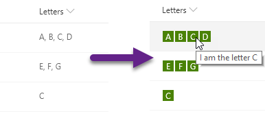

# Multi-Choice forEach

## Summary
This sample demonstrates usage of the `forEach` property to create template elements applied to each choice in a multi-select choice field.

## View requirements
- This format can be applied to a Multi-Select Choice column
- This format uses operators only available in SharePoint Online and cannot be used in SharePoint 2019

## Sample

Solution|Author(s)
--------|---------
multi-choice-foreach.json | [Chris Kent](https://github.com/thechriskent) ([@thechriskent](https://twitter.com/thechriskent))

## Version history

Version|Date|Comments
-------|----|--------
1.0|April 4, 2019|Initial release

## Disclaimer
**THIS CODE IS PROVIDED *AS IS* WITHOUT WARRANTY OF ANY KIND, EITHER EXPRESS OR IMPLIED, INCLUDING ANY IMPLIED WARRANTIES OF FITNESS FOR A PARTICULAR PURPOSE, MERCHANTABILITY, OR NON-INFRINGEMENT.**

---

## Additional notes

- [Use column formatting to customize SharePoint](https://docs.microsoft.com/en-us/sharepoint/dev/declarative-customization/column-formatting)

- For a more elaborate usage of `forEach` check out the [multi-person-facepile](../multi-person-facepile) sample.

