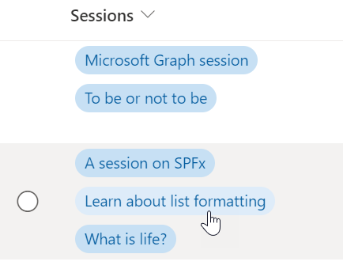
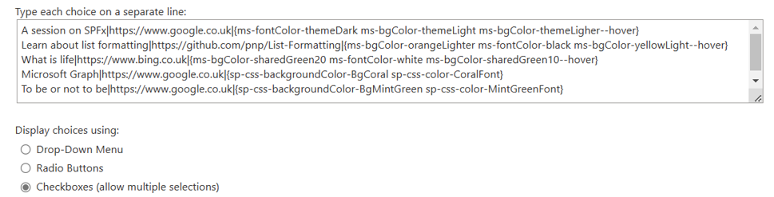

# Multi-Choice Links

## Summary
This sample shows how we can display multiple links in a single column using the multi-choice column.

**Note:** If rich text column is used to display links then this sample can be ignored. 



## View requirements
The sample expects the choices in the `Sessions` column to use the format `<Link Title>|<The actual link>|`.

For Example - if the link we want to display has the title `Learn about list formatting` and the actual link is `https://pnp.github.io/sp-dev-list-formatting` then the choice for that in the `Sessions` column should be `Learn about list formatting|https://pnp.github.io/sp-dev-list-formatting|`.

Session column's choice values used in the example screenshot above:


### Advanced Format

Also included is an additional format (multi-choice-links-advanced.json) that sets the background and text colors for each link. This sample format expects the choices to be in the format `<Link Title>|<The actual link>|{Predefined classes}`.



## Details of the sample

To display the links, we loop through the values present in the multi-choice column of the current item and extract the `<Link title>` using this formula:
```JSON
"=substring([$choiceIterator], 0, indexOf([$choiceIterator], '|'))"
```

We then extract `<the actual link>` using this formula:
```JSON
"=substring([$choiceIterator], indexOf([$choiceIterator], '|') + 1,  lastIndexOf([$choiceIterator], '|'))"
```

## Sample

Solution|Author(s)
--------|---------
multi-choice-links.json | [Anoop Tatti](https://github.com/anoopt) ([@anooptells](https://twitter.com/anooptells))
multi-choice-links-advanced.json | [Abhijeet Jadhav](https://github.com/TekExpo)

## Version history

Version|Date|Comments
-------|----|--------
1.0|April 14, 2021 |Initial release
1.1|March 17, 2023 |Added multi-choice-links-advanced.json

## Disclaimer
**THIS CODE IS PROVIDED *AS IS* WITHOUT WARRANTY OF ANY KIND, EITHER EXPRESS OR IMPLIED, INCLUDING ANY IMPLIED WARRANTIES OF FITNESS FOR A PARTICULAR PURPOSE, MERCHANTABILITY, OR NON-INFRINGEMENT.**

---


