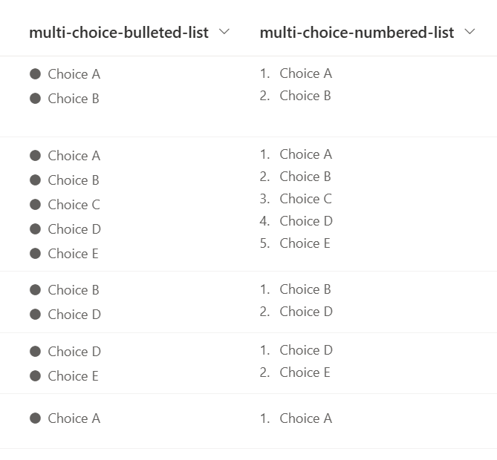
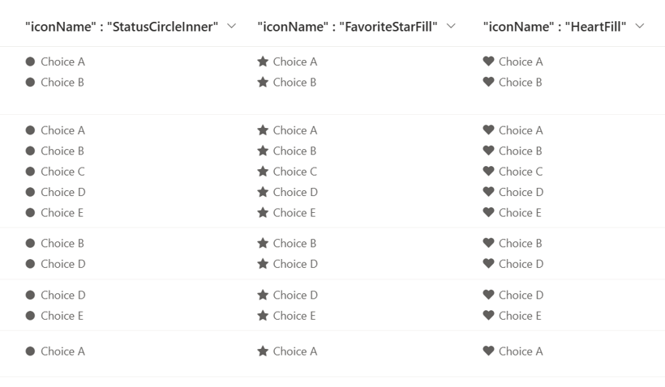

# Bulleted and Numbered List

## Summary
This sample demonstrates displaying Multi-Select Choice column values like a bulleted and numbered list.

The bullet list symbols use [Fluent UI Icons](https://developer.microsoft.com/en-us/fluentui#/styles/web/icons), which can be changed to stars, hearts, etc. by changing the value of the `iconName` property.

## View requirements
This format can be applied to a Multi-Select Choice column.

## Sample

Solution|Author(s)
--------|---------
multi-choice-list.json | [Tetsuya Kawahara](https://github.com/tecchan1107) ([@techan_k](https://twitter.com/techan_k))
multi-choice-numbered-list.json | [Tetsuya Kawahara](https://github.com/tecchan1107) ([@techan_k](https://twitter.com/techan_k))

## Version history

Version |Date             |Comments
--------|-----------------|----------------
1.0     |January 14, 2023 |Initial release

## Disclaimer
**THIS CODE IS PROVIDED *AS IS* WITHOUT WARRANTY OF ANY KIND, EITHER EXPRESS OR IMPLIED, INCLUDING ANY IMPLIED WARRANTIES OF FITNESS FOR A PARTICULAR PURPOSE, MERCHANTABILITY, OR NON-INFRINGEMENT.**

