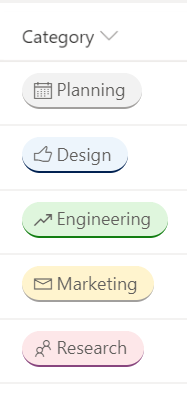

# Work Progress Category Pill

## Summary

This JSON sample demonstrates how you can format the work progress category choices as pills found in the newly released Microsoft Lists Work progress tracker template.

## View requirements

* The `multi-choice-workcategory-pill.json` format can be applied to any multiple selection choice column, while the `text-column-workcategory-pill.json` format can be applied to other columns. Both formats expect the column values to be one of the following choices:
  + Planning
  + Design
  + Engineering
  + Marketing
  + Research

## Sample

Solution|Author(s)
--------|---------
multi-choice-workcategory-pill.json | [Ganesh Sanap](https://github.com/ganesh-sanap) ([@ganeshsanap20](https://twitter.com/ganeshsanap20))
text-column-workcategory-pill.json | [Ganesh Sanap](https://github.com/ganesh-sanap) ([@ganeshsanap20](https://twitter.com/ganeshsanap20)) & [Watana](https://github.com/watana2)

## Version history

| Version | Date          | Comments        |
|---------|---------------|-----------------|
| 1.0     | August 08, 2020 | Initial release |
| 1.1     | November 1, 2024 | Added text-column-workcategory-pill.json |

## Disclaimer

**THIS CODE IS PROVIDED *AS IS* WITHOUT WARRANTY OF ANY KIND, EITHER EXPRESS OR IMPLIED, INCLUDING ANY IMPLIED WARRANTIES OF FITNESS FOR A PARTICULAR PURPOSE, MERCHANTABILITY, OR NON-INFRINGEMENT.**

---

## Additional notes

This sample uses some predefined classes also covered in the official documentation of Column Formatting:

- [Use column formatting to customize SharePoint - Style guidelines](https://docs.microsoft.com/en-us/sharepoint/dev/declarative-customization/column-formatting#style-guidelines)

