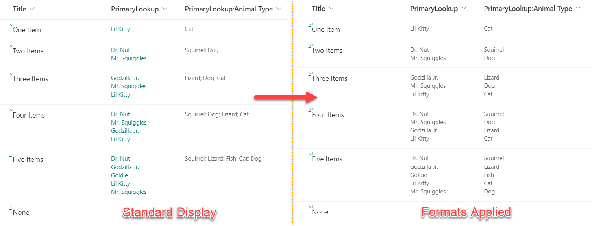
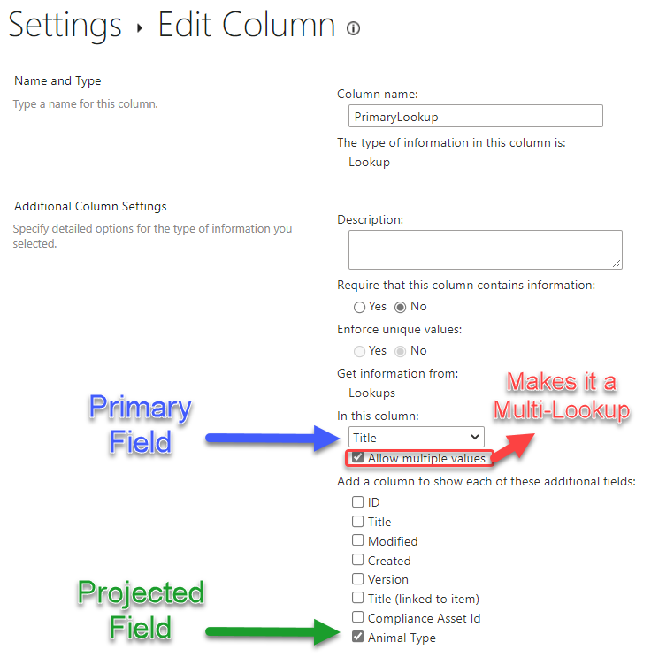

# Multi-lookup fields and projected fields

## Summary
Lookup columns that support multiple values can be formatted using the advanced `forEach` property. 
Since the inclusion of the split operation, projected fields (additional columns associated to your lookup column) can now also be formatted using the same method. This sample provides two formats illustrating the difference in how these columns are formatted.

### Multi-Lookup Columns vs Projected Fields

A lookup column becomes a multi-lookup column when you check the _Allow multiple values_ box under the primary column selection in the classic Column Settings screen for the Lookup column. If you check the box for any additional columns, these values become [projected fields](https://docs.microsoft.com/en-us/sharepoint/dev/schema/projectedfields-element-view).

### Formatting Multi-Lookup Columns

The `multi-lookup.json` format should be applied to your primary lookup column. This format uses the [`forEach`](https://docs.microsoft.com/sharepoint/dev/declarative-customization/column-formatting?#foreach) property to act as a template elment for each selected lookup value for an item. This format puts each value in its own box.

We are accessing the value portion of the lookup item by using the `lookupValue` syntax (alternatively, we could access the lookup list's item id for the item with `lookupId`).

### Formatting Multi-Lookup Projected Fields

Unfortunately, multi-lookup projected fields don't come back as nice. Instead of being an array of objects, the values are all joined into a single line of text with multiple values separated by a space and a semi-colon (as seen in the Standard Display above).

We can now use the `split` operation to separate the string into an array which can then be used with the `forEach` property, with the `$itemIterator` value for the `txtContent`.

It's ideal to match the formatting properties of the projected fields with the primary lookup column to ensure the values line up correctly.

## View requirements
- The `multi-lookup.json` format can be applied to any multi-value lookup column
- The `multi-lookup-projected-field.json` format can be applied to any projected field

## Sample

Solution|Author(s)
--------|---------
multi-lookup-projected-field.json | [Chris Kent](https://github.com/thechriskent) ([@thechriskent](https://twitter.com/thechriskent)), [Tim Hunt](https://github.com/timberrr)
multi-lookup.json | [Chris Kent](https://github.com/thechriskent) ([@thechriskent](https://twitter.com/thechriskent))

## Version history

Version|Date|Comments
-------|----|--------
1.0|April 22, 2021|Initial release
1.1|August 14, 2023|Updated projected field to use split and forEach

## Disclaimer
**THIS CODE IS PROVIDED *AS IS* WITHOUT WARRANTY OF ANY KIND, EITHER EXPRESS OR IMPLIED, INCLUDING ANY IMPLIED WARRANTIES OF FITNESS FOR A PARTICULAR PURPOSE, MERCHANTABILITY, OR NON-INFRINGEMENT.**

---

## Additional notes

- [Use column formatting to customize SharePoint](https://docs.microsoft.com/en-us/sharepoint/dev/declarative-customization/column-formatting#me)

