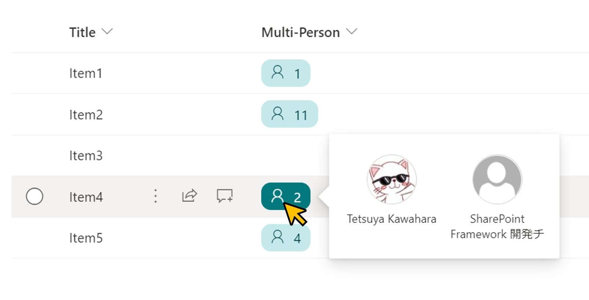

# Display the number of users

## Summary
This sample shows the number of users entered in a multi-select person column. The list of users can be viewed by hovering the mouse over the place where the number of users is displayed.

## View requirements
This format can be applied to a Managed Metadata column.

## Sample

Solution                |Author(s)
------------------------|---------------------------
multi-person-count.json |[Tetsuya Kawahara](https://twitter.com/techan_k)

## Version history

Version |Date         |Comments
--------|-------------|--------
1.0     |June 9, 2021 |Initial release

## Disclaimer
**THIS CODE IS PROVIDED *AS IS* WITHOUT WARRANTY OF ANY KIND, EITHER EXPRESS OR IMPLIED, INCLUDING ANY IMPLIED WARRANTIES OF FITNESS FOR A PARTICULAR PURPOSE, MERCHANTABILITY, OR NON-INFRINGEMENT.**

