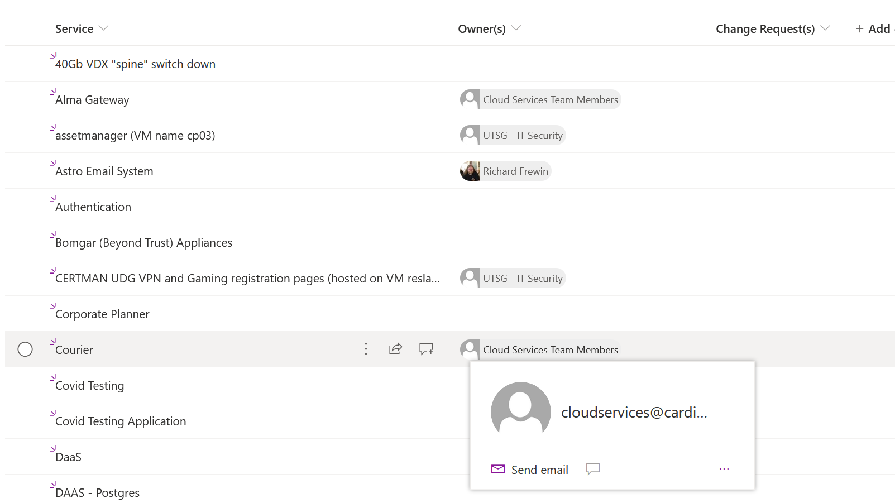

# Highlight the current user

## Summary
This sample uses a pill format to display both the profile picture and display name of a multi-person column. 

## View requirements
- This format can be applied to a Multi-Person column (with or without Group Selection)
- This format uses operators only available in SharePoint Online and cannot be used in SharePoint 2019

## Sample

Solution|Author(s)
--------|---------
multi-person-default-hover-cards.json | [Nick Brown](https://twitter.com/techienickb)

## Version history

Version|Date|Comments
-------|----|--------
1.0|February 1, 2021|Initial release

## Disclaimer
**THIS CODE IS PROVIDED *AS IS* WITHOUT WARRANTY OF ANY KIND, EITHER EXPRESS OR IMPLIED, INCLUDING ANY IMPLIED WARRANTIES OF FITNESS FOR A PARTICULAR PURPOSE, MERCHANTABILITY, OR NON-INFRINGEMENT.**

---

## Additional notes

- [Use column formatting to customize SharePoint](https://docs.microsoft.com/en-us/sharepoint/dev/declarative-customization/column-formatting#me)