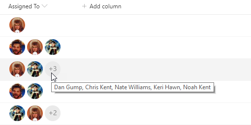

# Multi-Person Facepile

## Summary
This sample provides rounded images for each person in a multi-select person field.

The sample demonstrates the use of the `forEach` property to apply a format for each value of an array (multi-select person fields). Additionally, the `loopIndex` operator is used in conjunction with the `length` operator to ensure that regardless of how many persons are selected the field doesn't run over. This style of profile pictures with a descriptive overflow is often called a [facepile](https://developer.microsoft.com/en-us/fabric#/components/facepile)

### User Profile Picture sizes

|Key|Size|
|:---:|:---:|
|S|48x48|
|M|72x72|
|L|300x?*|

The L size profile pictures maintain the ratio of the original photo which means they are not guaranteed to be square. Neither are they guaranteed to be 300px wide. The maximum width will be 300px but if the original image was smaller than that, then it will be the original size. Even the placeholder image for the L size is only 250x150.

Overall, however, the L size shouldn't be used inside columns not only because the ratio is not guaranteed, but because the default column width won't allow you to take up that much space.

> Note: `@currentField.picture` can be used to retrieve a profile picture directly from a person column. However, size options are not available using that approach.

## View requirements
- This format can be applied to a Multi-Select Person column
- This format uses operators only available in SharePoint Online and cannot be used in SharePoint 2019

## Sample

Solution|Author(s)
--------|---------
multi-person-facepile.json | [Chris Kent](https://twitter.com/thechriskent)

## Version history

Version|Date|Comments
-------|----|--------
1.0|April 4, 2019|Initial release
1.1|January 22, 2020|Added vertical-align property for use in Microsoft Teams

## Disclaimer
**THIS CODE IS PROVIDED *AS IS* WITHOUT WARRANTY OF ANY KIND, EITHER EXPRESS OR IMPLIED, INCLUDING ANY IMPLIED WARRANTIES OF FITNESS FOR A PARTICULAR PURPOSE, MERCHANTABILITY, OR NON-INFRINGEMENT.**

---

## Additional notes

- [Use column formatting to customize SharePoint](https://docs.microsoft.com/en-us/sharepoint/dev/declarative-customization/column-formatting)

- A format geared toward providing a rounded image for single person fields can be found here: [person-roundimage-format](../person-roundimage-format)

