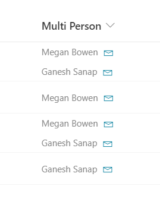

# Multi-Person Mail To Link

## Summary

This column formatting sample demonstrates how to add a `mailto:` link for each person in a multiple selection person column.

This sample is derived from [person-mailto](https://github.com/pnp/List-Formatting/tree/master/column-samples/person-mailto).

## View requirements

This format expects to be applied to a multiple selection person column.

## Sample

Solution|Author(s)
--------|---------
multi-person-mailto.json | [Ganesh Sanap](https://github.com/ganesh-sanap) ([@ganeshsanap20](https://twitter.com/ganeshsanap20))

## Version history

Version |Date          |Comments
--------|--------------|--------------------------------
1.0     |December 12, 2021 |Initial release

## Disclaimer

**THIS CODE IS PROVIDED *AS IS* WITHOUT WARRANTY OF ANY KIND, EITHER EXPRESS OR IMPLIED, INCLUDING ANY IMPLIED WARRANTIES OF FITNESS FOR A PARTICULAR PURPOSE, MERCHANTABILITY, OR NON-INFRINGEMENT.**

