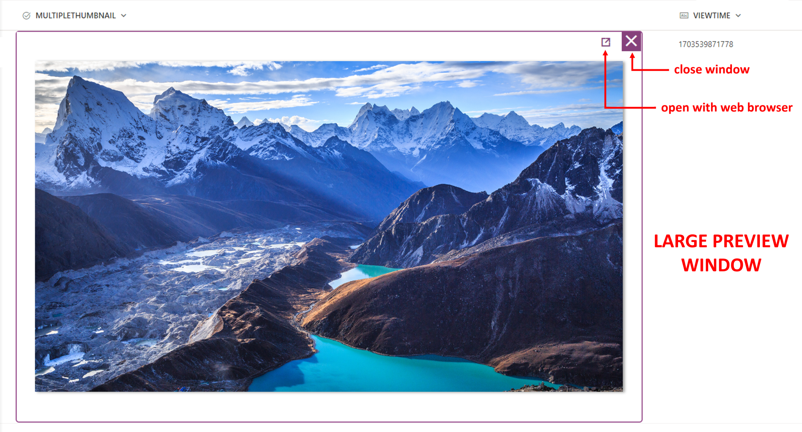

## WHAT IS IT?
This tutorial will help you create a multiple thumbnail through images URLs listed in a **multiple choice column**. To achieve this result, you can implement one of the following column formatting options:

**1. Basic thumbnail**: each URL is displayed with its own miniature and a little button to open each image through your default web browser.

**2. Advanced thumbnail**: each URL is displayed with its own miniature and each image can be viewed in a larger version through a temporary UI window. This window contains a command bar to open Microsoft Designer as well as the option to open an image through your default web browser.

**NOTE**: an image URLs should point directly to a picture file format, such as **jpg, png, gif, etc**. Furthermore, each image URL can come from an [allowed external domain](https://support.microsoft.com/office/allow-or-restrict-the-ability-to-embed-content-on-sharepoint-pages-e7baf83f-09d0-4bd1-9058-4aa483ee137b) or it should be accessible by other users if stored in SharePoint.

Examples of images URLs are:

- ✔️ https://www.example.com/products/images/helloworld.jpg (external domain)
- ✔️ https://cdn.example.com/media/cms/images/helloworld.webp (external domain)
- ✔️ https://contoso.sharepoint.com/sites/marketing/Document-Library/Images/helloworld.png (SharePoint)

### User experience
In order to get an optimal user esperience, Microsoft Lists web app or Microsoft Lists PWA [Progressive Web App](https://lists.handsontek.net/install-microsoft-lists-pwa-application/) are recommended.

***

### 1) Basic thumbnail: how to
The basic thumbnail template requires only one **multiple choice column**, with custom values allowed or not. After creating a multiple choice column, apply the JSON code available [**here**](./Thumbnail-basic.json).

***

### 2) Advanced thumbnail: how to

The advanced thumbnail template requires users to have **editing permission** (eg. in a project team members) and the following columns, including their **exact names with capital letters**. The exact names are required only for columns creation, so that they'll match with the internal names the JSON code refers to. Therefore, all the columns listed below <ins>can be renamed later</ins>:

|**COLUMN NAME**|**COLUMN TYPE**|**ADDITIONAL INFORMATION**|
|---|---|---|
|**MULTIPLETHUMBNAIL**|Multiple choice|Each image URL is a corresponding option of this column|
|**LASTURL**|Multiple lines of text|This column keeps track temporarily of an image URL, when a user clicks on a miniature to open a larger window|
|**VIEWTIME**| Single line of text |This column keeps track of the current date and time to perform an if condition **temporarily true**, so that a larger preview window works properly on click|

After creating the 3 columns reported above, format the **MULTIPLETHUMBNAIL** column with the JSON code available [**here**](./Thumbnail-advanced.json).

Here is an illustration of the large preview window:

### Temporary preview window: behind the scenes
If you are wondering what's happening when a user clicks on a miniature, here is a process illustration about how a temporary window works in Microsoft Lists:

## Sample

Solution|Author(s)
--------|---------
Thumbnail-basic.json | [Federico Sapia](https://github.com/Fedes365) ([LinkedIn](https://www.linkedin.com/in/federicosapia/))
Thumbnail-advanced.json | [Federico Sapia](https://github.com/Fedes365) ([LinkedIn](https://www.linkedin.com/in/federicosapia/))

## Version history

Version |Date              |Comments
--------|------------------|--------------------------------
1.0     |January 02, 2024  |Initial release

## Disclaimer
**THIS CODE IS PROVIDED *AS IS* WITHOUT WARRANTY OF ANY KIND, EITHER EXPRESS OR IMPLIED, INCLUDING ANY IMPLIED WARRANTIES OF FITNESS FOR A PARTICULAR PURPOSE, MERCHANTABILITY, OR NON-INFRINGEMENT.**

