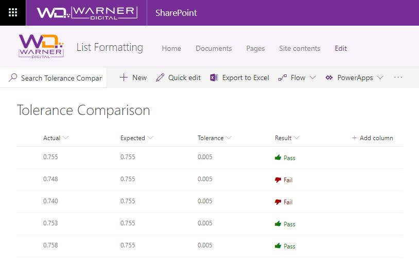

# Tolerance Comparison

## Summary

Display if a value is within the expected tolerance.

To determine success, the column formatting definition subtracts the "Actual" value from the "Expected" value and applies the "abs()" operator to retrieve the absolute value. The result is compared to the "Tolerance" column value to determine pass or fail.

A Fluent UI icon is also applied to provide visual indicators of Pass or Fail.

### Screenshot

## Column Types
The columns used in this sample were created as "Number" column types.

## View requirements
- This format uses operators only available in SharePoint Online and cannot be used in SharePoint 2019

## Sample

Solution|Author(s)
--------|---------
number-abs-tolerance-comparison.json | [David Warner II](https://github.com/PopWarner)

## Version history

Version|Date|Comments
-------|----|--------
1.0|March 8, 2019|Initial release

## Disclaimer
**THIS CODE IS PROVIDED *AS IS* WITHOUT WARRANTY OF ANY KIND, EITHER EXPRESS OR IMPLIED, INCLUDING ANY IMPLIED WARRANTIES OF FITNESS FOR A PARTICULAR PURPOSE, MERCHANTABILITY, OR NON-INFRINGEMENT.**

---

## Additional notes

- [Use column formatting to customize SharePoint](https://docs.microsoft.com/en-us/sharepoint/dev/declarative-customization/column-formatting)

