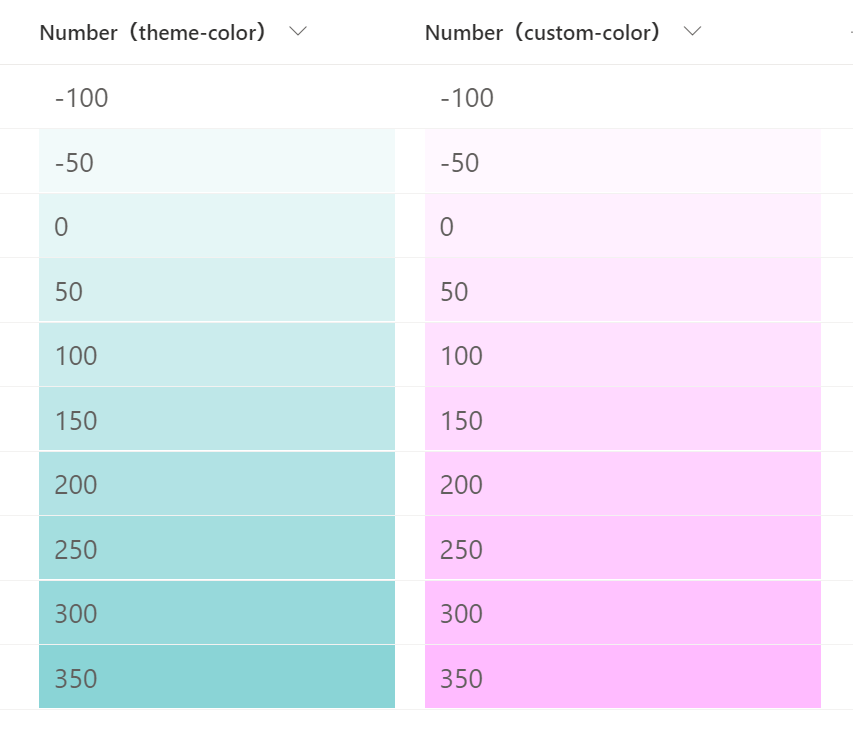

# Shaded Backgrounds

## Summary
This sample demonstrates how to change the shade of the background color depending on the value of the number column. Also, in this sample, the background color is lightest at `-100` and darkest at `350`.

- `number-background-color-shading.json` uses your site's theme color as the background color.
- `number-background-color-shading-custom-color.json` uses the HTML color code as the background color, and in the sample, `#FFBBFF` is set.

## View requirements

This format can be applied to a Number column.

## Sample

Solution|Author(s)
--------|---------
number-background-color-shading.json | [Tetsuya Kawahara](https://github.com/tecchan1107) ([@techan_k](https://twitter.com/techan_k))
number-background-color-shading-custom-color.json | [Tetsuya Kawahara](https://github.com/tecchan1107) ([@techan_k](https://twitter.com/techan_k))

## Version history

Version |Date             |Comments
--------|-----------------|----------------
1.0     |November 16, 2021|Initial release

## Disclaimer
**THIS CODE IS PROVIDED *AS IS* WITHOUT WARRANTY OF ANY KIND, EITHER EXPRESS OR IMPLIED, INCLUDING ANY IMPLIED WARRANTIES OF FITNESS FOR A PARTICULAR PURPOSE, MERCHANTABILITY, OR NON-INFRINGEMENT.**

