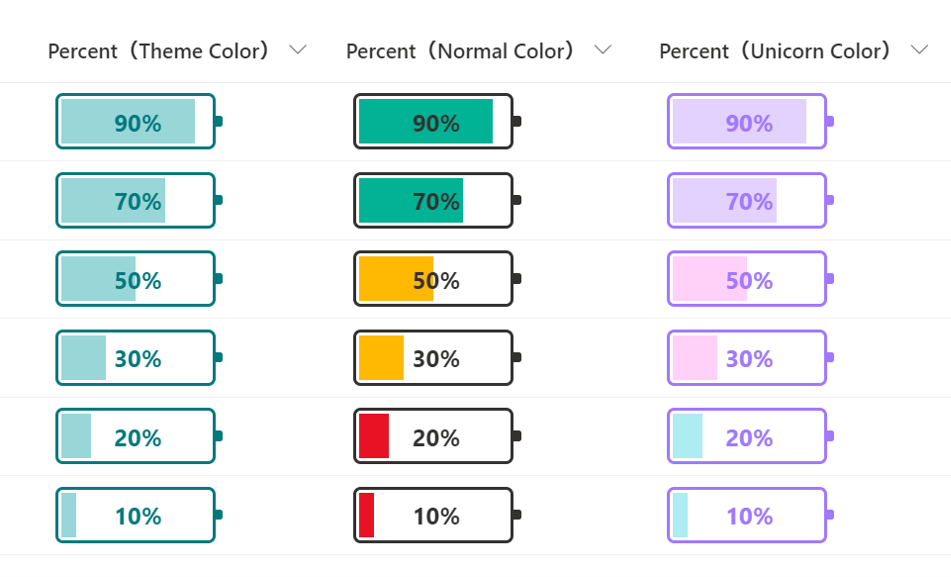

# Number Battery

## Summary
This sample changes the appearance of the values in number columns (percent)  to look like a battery.

- `number-battery-theme-color.json` displays a battery of colors for the site's theme color. The background color will not change depending on the value.
- `number-battery-normal-color.json` and `number-battery-unicorn-color.json` are independent of the site theme color. Also, the background color will change depending on the value: greater than 50%, greater than 20%, and greater than 0%.

## View requirements
This format can be applied to a Number column. It is expected that the values will be from 0 to 1 (percent).

## Sample

Solution                          |Author(s)
----------------------------------|------------------------------------------------
number-battery-theme-color.json   |[Tetsuya Kawahara](https://twitter.com/techan_k)
number-battery-normal-color.json  |[Tetsuya Kawahara](https://twitter.com/techan_k)
number-battery-unicorn-color.json |[Tetsuya Kawahara](https://twitter.com/techan_k)

## Version history

Version |Date          |Comments
--------|--------------|----------------
1.0     |May 2, 2021   |Initial release
1.1     |June 23, 2021 |Added 2 samples

## Disclaimer
**THIS CODE IS PROVIDED *AS IS* WITHOUT WARRANTY OF ANY KIND, EITHER EXPRESS OR IMPLIED, INCLUDING ANY IMPLIED WARRANTIES OF FITNESS FOR A PARTICULAR PURPOSE, MERCHANTABILITY, OR NON-INFRINGEMENT.**

