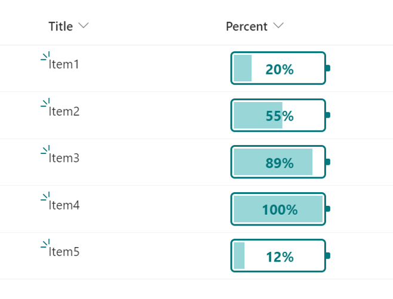

# Number Battery

## Summary
This sample changes the appearance of the values in number columns (percent)  to look like a battery.

## View requirements
This format can be applied to a Number column. It is expected that the values will be from 0 to 1 (percent).

## Sample

Solution            |Author(s)
--------------------|------------------------------------------------
number-battery.json |[Tetsuya Kawahara](https://twitter.com/techan_k)

## Version history

Version |Date        |Comments
--------|------------|----------------
1.0     |May 2, 2021 |Initial release

## Disclaimer
**THIS CODE IS PROVIDED *AS IS* WITHOUT WARRANTY OF ANY KIND, EITHER EXPRESS OR IMPLIED, INCLUDING ANY IMPLIED WARRANTIES OF FITNESS FOR A PARTICULAR PURPOSE, MERCHANTABILITY, OR NON-INFRINGEMENT.**

