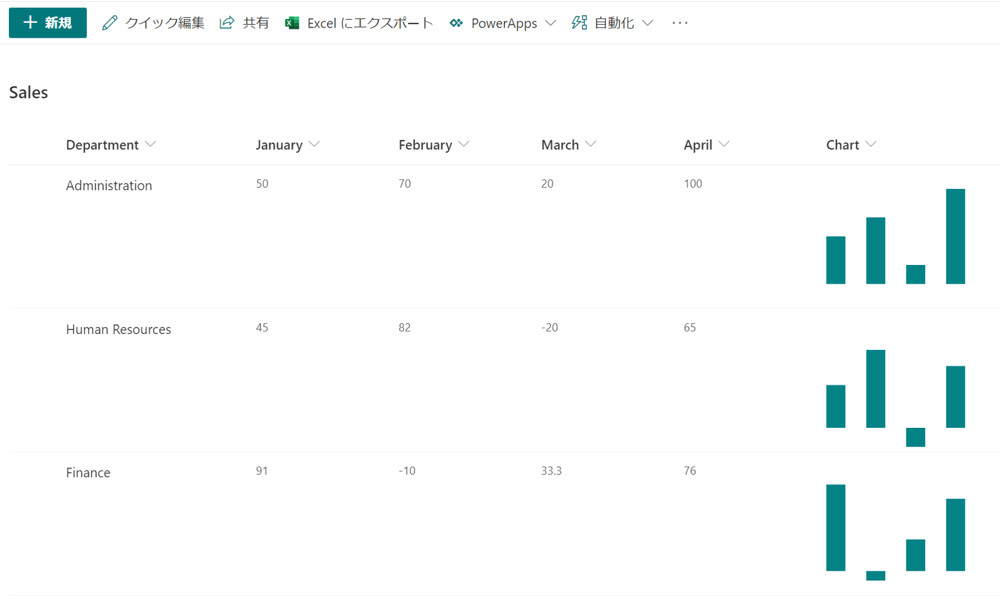

# Display a column chart

## Summary
This sample demonstrates displaying a column chart using SVG.

## View requirements
- This format can be applied to any column type though the example is based on -

Column Name   |Type
--------------|--------------
January       | Number
February      | Number
March         | Number
April         | Number
Chart         | Single Line Text

## Sample

Solution                 |Author(s)
-------------------------|---------------------------
number-column-chart.json |  [Tetsuya Kawahara](https://twitter.com/techan_k)

## Version history

Version |Date             |Comments
--------|-----------------|--------
1.0     |October 10, 2020 |Initial release

## Disclaimer
**THIS CODE IS PROVIDED *AS IS* WITHOUT WARRANTY OF ANY KIND, EITHER EXPRESS OR IMPLIED, INCLUDING ANY IMPLIED WARRANTIES OF FITNESS FOR A PARTICULAR PURPOSE, MERCHANTABILITY, OR NON-INFRINGEMENT.**

