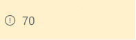

# Conditional formatting based on a number range

## Summary
This example uses the conditional operator `?` to apply a class (`sp-field-severity--warning`) to the parent `
` element when the  value in the current field is less than or equal to 70.  This causes the field to be highlighted when the value is less than or equal to 70, and appear normally if it's greater than 70.

## View requirements
- This format can be applied to a Number column

## Sample

Solution|Author(s)
--------|---------
number-conditional-format.json | SharePoint Team

## Version history

Version|Date|Comments
-------|----|--------
1.0|November 2, 2017|Initial release
1.1|August 20, 2018|Switched to Excel-style expressions

## Disclaimer
**THIS CODE IS PROVIDED *AS IS* WITHOUT WARRANTY OF ANY KIND, EITHER EXPRESS OR IMPLIED, INCLUDING ANY IMPLIED WARRANTIES OF FITNESS FOR A PARTICULAR PURPOSE, MERCHANTABILITY, OR NON-INFRINGEMENT.**

---

## Additional notes
This sample is also covered in the main documentation around the Column Formatting

- [Use column formatting to customize SharePoint](https://docs.microsoft.com/en-us/sharepoint/dev/declarative-customization/column-formatting)

> An additional version using Abstract Tree Syntax (AST) is also provided for environments where the Excel-style expressions are not supported.

