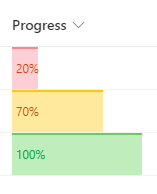

# Conditional Progress Color

## Summary
This sample demonstrates displaying progress bar with conditional color based on the value.
- Red for value <= 0.3 (30%)
- Yellow for 0.3 (30%) < value < 1 (100%)
- Green for value == 1 (100%)

## View requirements
- This format can be applied to a Number column. It is expected that the values will be from 0 to 1 (percent)

## Sample

Solution|Author(s)
--------|---------
number-conditional-progress-color.json | [Ari Gunawan](https://github.com/AriGunawan) ([@arigunawan3023](https://twitter.com/arigunawan3023))

## Version history

Version|Date|Comments
-------|----|--------
1.0|October 9, 2021|Initial release

## Disclaimer
**THIS CODE IS PROVIDED *AS IS* WITHOUT WARRANTY OF ANY KIND, EITHER EXPRESS OR IMPLIED, INCLUDING ANY IMPLIED WARRANTIES OF FITNESS FOR A PARTICULAR PURPOSE, MERCHANTABILITY, OR NON-INFRINGEMENT.**

---

## Additional notes

- [Use column formatting to customize SharePoint](https://docs.microsoft.com/en-us/sharepoint/dev/declarative-customization/column-formatting)

