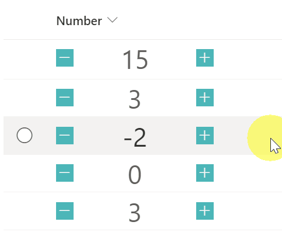

# Display Count Up and Count Down Buttons

## Summary
This sample demonstrates a button with a number increasing by one and a button with a number decreasing by one. Also, this sample uses the `setValue` of `customRowAction` to update the field. You need to set the `actionInput` to the internal name of the column to be updated.

## View requirements
This format can be applied to a Number column.

## Sample

Solution|Author(s)
--------|---------
number-countup-countdown.json | [Tetsuya Kawahara](https://github.com/tecchan1107)

## Version history

Version |Date              |Comments
--------|------------------|--------
1.0     |November 21, 2021 |Initial release

## Disclaimer
**THIS CODE IS PROVIDED *AS IS* WITHOUT WARRANTY OF ANY KIND, EITHER EXPRESS OR IMPLIED, INCLUDING ANY IMPLIED WARRANTIES OF FITNESS FOR A PARTICULAR PURPOSE, MERCHANTABILITY, OR NON-INFRINGEMENT.**

