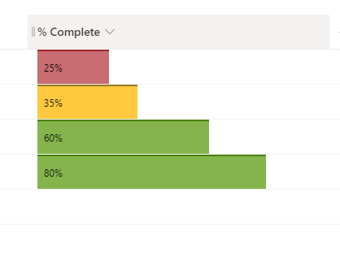

# Number column as data bars with multiple colors

## Summary

This column formatting sample demonstrates how to show the number column as data bars with multiple colors. Background color changes depending on the value: 

Value                       |Color
----------------------------|---------------------------
0% - 25% |Red
26% - 50% |Yellow
51% - 100% |Green

This sample is derived from [number-data-bar](https://github.com/pnp/List-Formatting/tree/master/column-samples/number-data-bar).

## View requirements

This format can be applied to a Number column. It is expected that the values will be from 0 to 1 (percent).

## Sample

Solution                       |Author(s)
-------------------------------|---------------------------
number-data-bar-multi-color.json |[Ganesh Sanap](https://twitter.com/GaneshSanap20)

## Version history

Version |Date          |Comments
--------|--------------|--------------------------------
1.0     |December 29, 2021 |Initial release

## Disclaimer

**THIS CODE IS PROVIDED *AS IS* WITHOUT WARRANTY OF ANY KIND, EITHER EXPRESS OR IMPLIED, INCLUDING ANY IMPLIED WARRANTIES OF FITNESS FOR A PARTICULAR PURPOSE, MERCHANTABILITY, OR NON-INFRINGEMENT.**

