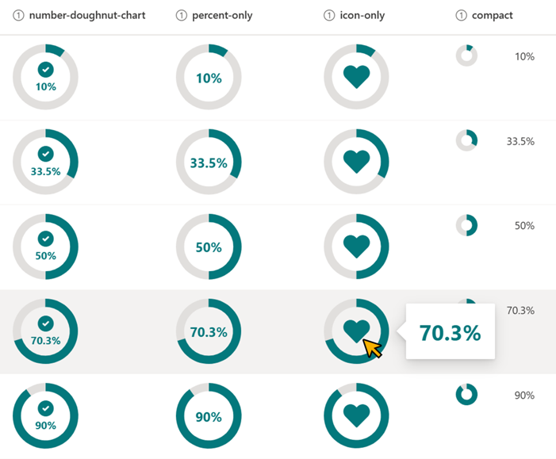

# Doughnut Chart

## Summary
This sample changes the appearance of the values in number columns (percent) to a donut chart. The donut chart is displayed using `svg`.

## View requirements
This format can be applied to a Number column. It is expected that the values will be from 0 to 1 (percent).

## Sample

Solution                                |Author(s)
----------------------------------------|------------------------------------------------
number-doughnut-chart-icon-percent.json |[Tetsuya Kawahara](https://twitter.com/techan_k)
number-doughnut-chart-percent-only.json |[Tetsuya Kawahara](https://twitter.com/techan_k)
number-doughnut-chart-icon-only.json    |[Tetsuya Kawahara](https://twitter.com/techan_k)

## Version history

Version |Date            |Comments
--------|----------------|----------------
1.0     |August 20, 2021 |Initial release

## Disclaimer
**THIS CODE IS PROVIDED *AS IS* WITHOUT WARRANTY OF ANY KIND, EITHER EXPRESS OR IMPLIED, INCLUDING ANY IMPLIED WARRANTIES OF FITNESS FOR A PARTICULAR PURPOSE, MERCHANTABILITY, OR NON-INFRINGEMENT.**

---

## Additional notes
This sample uses icons from the Fluent UI

- [Fluent UI](https://developer.microsoft.com/en-us/fluentui)

