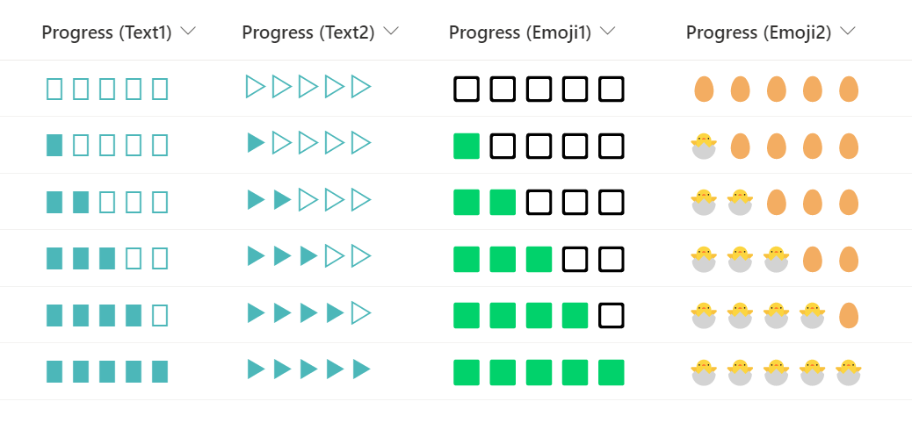

# Progress bar using text or emoji

## Summary
This sample demonstrates how to display a progress bar by repeating text or emoji using the `padStart` operator.

`padStart` is an operator that embeds a character string with another character string until the specified length is reached. However, if you specify a emoji as the embedding character, **the emoji is counted as 2 characters**, so you need to be careful how to set the specified length.

- `"txtContent":"=padStart('Dog', 7, 'A')"` results in `AAAADog`
- `"txtContent":"=padStart('Dog', 7, '🐶')"` results in `🐶🐶Dog`
- `"txtContent":"=padStart('', 10, 'C')"` results in `CCCCCCCCCC`
- `"txtContent":"=padStart('', 10, '😺')"` results in `😺😺😺😺😺`

## View requirements
This format can be applied to a Number column (the format expects values from 0-5)

## Sample

Solution|Author(s)
--------|---------
number-emoji-progressbar.json | [Tetsuya Kawahara](https://github.com/tecchan1107)
number-emoji-progressbar.json | [Tetsuya Kawahara](https://github.com/tecchan1107)

## Version history

Version |Date             |Comments
--------|-----------------|--------
1.0     |January 16, 2022 |Initial release

## Disclaimer
**THIS CODE IS PROVIDED *AS IS* WITHOUT WARRANTY OF ANY KIND, EITHER EXPRESS OR IMPLIED, INCLUDING ANY IMPLIED WARRANTIES OF FITNESS FOR A PARTICULAR PURPOSE, MERCHANTABILITY, OR NON-INFRINGEMENT.**

