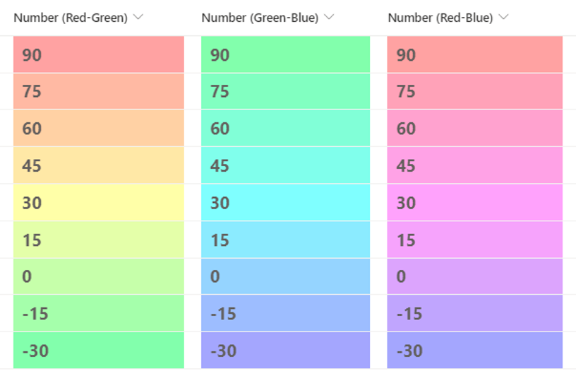

# Number Gradation

## Summary
This sample demonstrates a gradual background color change between the minimum and maximum values. In this sample, the minimum value is -30 and the maximum value is 90.

## View requirements
This format can be applied to a Number column. It is expected that the values will be from -30 to 90.

## Sample

Solution                         |Author(s)
---------------------------------|------------------------------------------------
number-gradation-red-green.json  |[Tetsuya Kawahara](https://twitter.com/techan_k)
number-gradation-green-blue.json |[Tetsuya Kawahara](https://twitter.com/techan_k)
number-gradation-red-blue.json   |[Tetsuya Kawahara](https://twitter.com/techan_k)

## Version history

Version |Date          |Comments
--------|--------------|----------------
1.0     |April 8, 2022 |Initial release

## Disclaimer
**THIS CODE IS PROVIDED *AS IS* WITHOUT WARRANTY OF ANY KIND, EITHER EXPRESS OR IMPLIED, INCLUDING ANY IMPLIED WARRANTIES OF FITNESS FOR A PARTICULAR PURPOSE, MERCHANTABILITY, OR NON-INFRINGEMENT.**

