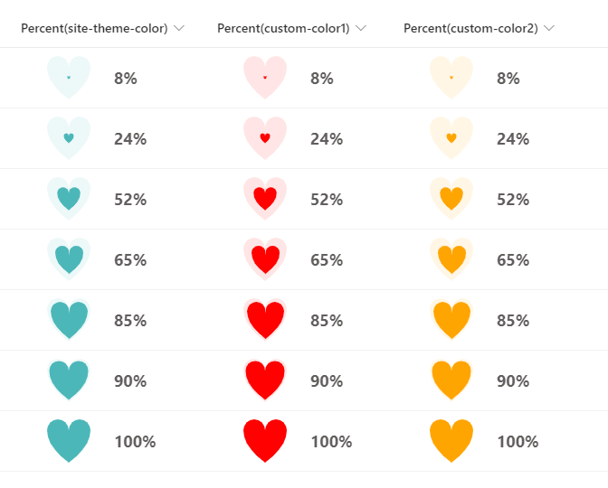

# Heart in Heart

## Summary
This sample demonstrates how to change the size of a heart by using the percent value of a numeric column.

- `number-heart-in-heart-site-theme-color` uses the theme color of the site as the color of the heart.
- `number-heart-in-heart-custom-color` uses the HTML color code as the the color of the heart, and in the sample, `#FF0000` is set.

## View requirements
This format can be applied to a Number column. It is expected that the values will be from 0 to 1 (percent).

## Sample

Solution                                   |Author(s)
-------------------------------------------|---------------------------
number-heart-in-heart-site-theme-color.json|[Tetsuya Kawahara](https://twitter.com/techan_k)
number-heart-in-heart-custom-color.json    |[Tetsuya Kawahara](https://twitter.com/techan_k)

## Version history

Version |Date              |Comments
--------|------------------|--------
1.0     |February 13, 2022 |Initial release

## Disclaimer
**THIS CODE IS PROVIDED *AS IS* WITHOUT WARRANTY OF ANY KIND, EITHER EXPRESS OR IMPLIED, INCLUDING ANY IMPLIED WARRANTIES OF FITNESS FOR A PARTICULAR PURPOSE, MERCHANTABILITY, OR NON-INFRINGEMENT.**

---

## Additional notes

The SVG heart in this sample is based on a sample from the following site.

- [d - SVG: Scalable Vector Graphics | MDN](https://developer.mozilla.org/en-US/docs/Web/SVG/Attribute/d)

