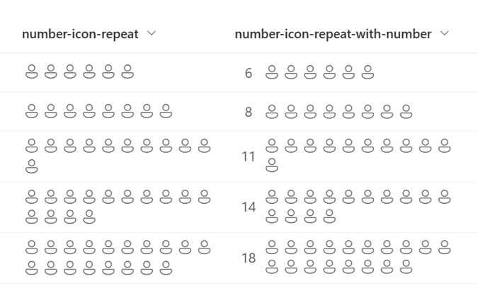
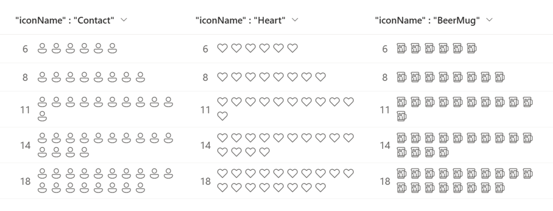

# Display of icons by repeating

## Summary
This sample demonstrates the use of the `padStart` and `split` operators to repeatedly display icons for the number of values in the number column.

It also uses [Fluent UI Icons](https://developer.microsoft.com/en-us/fluentui#/styles/web/icons), and by changing the `iconName` property, the icons to be displayed can be changed.

## View requirements
This format can be applied to a Number column.

## Sample

Solution|Author(s)
--------|---------
number-icon-repeat.json | [Tetsuya Kawahara](https://github.com/tecchan1107) ([@techan_k](https://twitter.com/techan_k))
number-icon-repeat-with-number.json | [Tetsuya Kawahara](https://github.com/tecchan1107) ([@techan_k](https://twitter.com/techan_k))

## Version history

Version |Date             |Comments
--------|-----------------|----------------
1.0     |January 14, 2023 |Initial release

## Disclaimer
**THIS CODE IS PROVIDED *AS IS* WITHOUT WARRANTY OF ANY KIND, EITHER EXPRESS OR IMPLIED, INCLUDING ANY IMPLIED WARRANTIES OF FITNESS FOR A PARTICULAR PURPOSE, MERCHANTABILITY, OR NON-INFRINGEMENT.**

