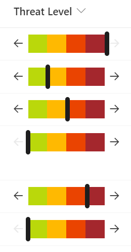

# Number Level Bar

## Summary
This sample demonstrates displaying a percentage across a bar. End users are able to edit the values by increasing/decreasing in 25% increments using arrow buttons.

## View requirements

This format can be applied to any number column. It expects the values to be percents (0-1) but the format could be adjusted for custom ranges by changing the expressions.

## Sample

Solution|Author(s)
--------|---------
number-level-bar.json | [Chris Kent](https://github.com/thechriskent)

## Version history

Version|Date|Comments
-------|----|--------
1.0|May 12, 2022|Initial release

## Disclaimer
**THIS CODE IS PROVIDED *AS IS* WITHOUT WARRANTY OF ANY KIND, EITHER EXPRESS OR IMPLIED, INCLUDING ANY IMPLIED WARRANTIES OF FITNESS FOR A PARTICULAR PURPOSE, MERCHANTABILITY, OR NON-INFRINGEMENT.**

---

## Additional notes

- [Use column formatting to customize SharePoint](https://docs.microsoft.com/en-us/sharepoint/dev/declarative-customization/column-formatting)

