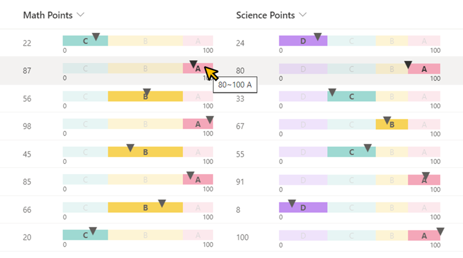
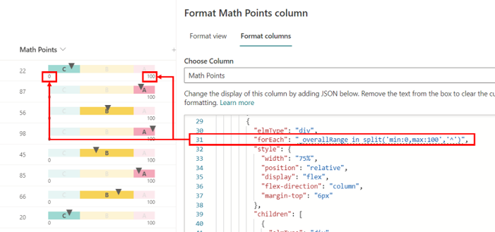
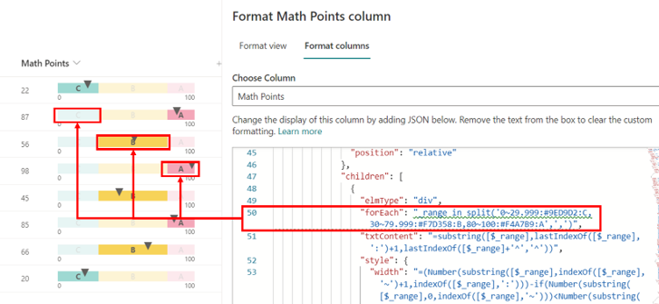
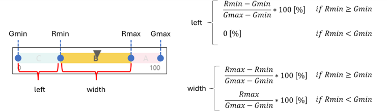

# Linear Gauge

## Summary

This sample demonstrates displaying a linear gauge.



## View requirements

- This format can be applied to a Number column.

## How to apply this sample

This sample needs modification for your specific use. Two changes are required.

### Step 1: Set the min and max values

1. Find the split operator on line 31 of the JSON.
2. Adjust the min and max values to match your desired range.

    ```
    "forEach": "_overallRange in split('min:MIN_VALUE,max:MAX_VALUE','^')",

    # Example
    "forEach": "_overallRange in split('min:0,max:100','^')",
    ```

    

### Step 2: Set numerical range, background color, and range name

1. Find the split operator on line 50 of the JSON.
2. Adjust the numerical range, background color, and range name for each range according to your use case. Use a comma-separated format.

    ```
    "forEach": "_range in split('RANGE_MIN~RANGE_MAX:HTML_COLOR_CODE_OR_NAME:RANGE_NAME',',')",

    # Example
    "forEach": "_range in split('0~29.999:#9ED9D2:C,30~79.999:#F7D358:B,80~100:#F4A7B9:A',',')",
    ```

    

#### Range setting examples:

- Using HTML color code:
    ```
    80~100:#F4A7B9:A
    ```

- Using HTML color name:
    ```
    80~100:Pink:A
    ```

- Range name not set:
    ```
    80~100:Pink:
    ```

- Using an underscore (\_) instead of single-byte spaces in the range name:
    ```
    80~100:Pink:Range_A
    ```

> [!NOTE]  
> - Avoid using single-byte spaces in range names to prevent errors. Instead, use an underscore (_), which will be replaced with single-byte spaces when displayed. (Related link: [#642](https://github.com/pnp/List-Formatting/issues/642))
> - Ensure non-overlapping ranges; use decimal points to fill gaps.
> - The value range can exceed the linear gauge's min and max.

## Sample

Solution|Author(s)
--------|---------
number-linear-gauge.json | [Tetsuya Kawahara](https://github.com/tecchan1107) ([@techan_k](https://twitter.com/techan_k))

## Version history

Version |Date             |Comments
--------|-----------------|--------
1.0     |December 1, 2023 |Initial release

## Disclaimer
**THIS CODE IS PROVIDED *AS IS* WITHOUT WARRANTY OF ANY KIND, EITHER EXPRESS OR IMPLIED, INCLUDING ANY IMPLIED WARRANTIES OF FITNESS FOR A PARTICULAR PURPOSE, MERCHANTABILITY, OR NON-INFRINGEMENT.**

---

## Additional notes

- The linear gauge adjusts based on the column width.
- The linear gauge is built using the following formulas.
    
    |Character|Meaning|Formula in JSON|
    |---|---|---|
    |Gmax|Max value of linear gauge|Number\(substring\(\[$_overallRange\],indexOf\(\[$_overallRange\],'max:'\)+4,indexOf\(\[$_overallRange\]+'^','^'\)\)\)|
    |Gmin|Min value of linear gage|Number\(substring\(\[$_overallRange\],indexOf\(\[$_overallRange\],'min:'\)+4,indexOf\(\[$_overallRange\],','\)\)\)|
    |Rmax|Max value of each range|Number\(substring\(\[$_range\],indexOf\(\[$_range\],'~'\)+1,indexOf\(\[$_range\],':'\)\)\)|
    |Rmin|Min value of each range|Number\(substring\(\[$_range\],0,indexOf\(\[$_range\],'~'\)\)\)|

