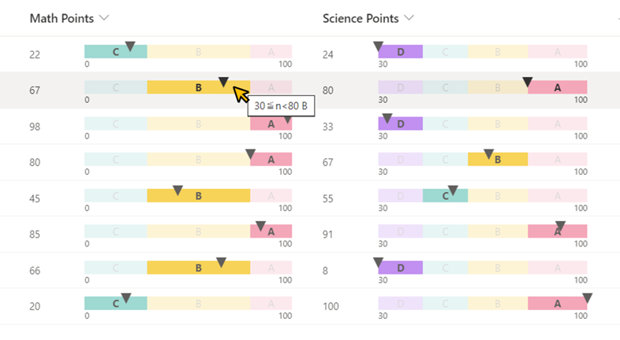

# Linear Gauge

## Summary

This sample demonstrates displaying a linear gauge from a regular string set to the split operator.



## View requirements

- This format can be applied to a Number column.

## How to apply this sample

This sample needs modification for your specific use. Two changes are required.

### Step 1: Set the min and max values

1. Find the split operator on line 31 of the JSON.
2. Adjust the min and max values to match your desired range.

    ```
    "forEach": "_overallRange in split('min:MIN_VALUE,max:MAX_VALUE','^')",

    # Example
    "forEach": "_overallRange in split('min:0,max:100','^')",
    ```

    

### Step 2: Set numerical range, background color, and range name

1. Find the split operator on line 50 of the JSON.
2. Adjust the numerical range, background color, and range name for each range according to your use case. Use a comma-separated format.

    ```
    "forEach": "_range in split('RANGE_MIN[<= or <]n[<= or <]RANGE_MAX:BACKGROUND_COLOR:RANGE_NAME',',')",

    # Example
    "forEach": "_range in split('0<=n<30:#9ED9D2:C,30<=n<80:#F7D358:B,80<=n<=100:#F4A7B9:A',',')",
    ```

    - **RANGE_MIN[<= or <]n[<= or <]RANGE_MAX:** Specifies the range of values for each segment of the linear gauge.
        - Example: `0<=n<30`, `0<n<=30`, `0<=n<=30`, `0<n<30`

    - **BACKGROUND_COLOR:** Defines the background color for the respective range.
        - Example: `#9ED9D2`, `Blue`

    - **RANGE_NAME:** Set the text to be displayed in the range.
        - Example: `A`, `Range_B`, `Great`

    

> [!NOTE]  
> - Expressions such as `n>=20` or `20<n` are not acceptable for numeric ranges. Please strictly adhere to the specified format `RANGE_MIN[<= or <]n[<= or <]RANGE_MAX`.
> - The value range can exceed the linear gauge's min and max.
> - Make sure that the values do not overlap between ranges.
> - Avoid single-byte spaces in the string to prevent errors. For single-byte spaces in range names, use an underscore (\_) instead. The underscore (\_) will be converted to half-width spaces when displayed. (Related link: [#642](https://github.com/pnp/List-Formatting/issues/642))
> - Do not use `<`, `:`, and `=` in range names.

#### Range setting examples:

- Using HTML color code:
    ```
    80<=n<=100:#F4A7B9:A
    ```

- Using HTML color name:
    ```
    30<=n<80:Yellow:B
    ```

- Range name not set:
    ```
    50<=n<60:#00FF00:
    ```

- Using an underscore (\_) instead of single-byte spaces in the range name:
    ```
    90<=n<=100:#FFD700:Range_D
    ```

## Sample

Solution|Author(s)
--------|---------
number-linear-gauge.json | [Tetsuya Kawahara](https://github.com/tecchan1107) ([@techan_k](https://twitter.com/techan_k))

## Version history

Version |Date             |Comments
--------|-----------------|--------
1.0     |December 1, 2023 |Initial release

## Disclaimer
**THIS CODE IS PROVIDED *AS IS* WITHOUT WARRANTY OF ANY KIND, EITHER EXPRESS OR IMPLIED, INCLUDING ANY IMPLIED WARRANTIES OF FITNESS FOR A PARTICULAR PURPOSE, MERCHANTABILITY, OR NON-INFRINGEMENT.**

---

## Additional notes

- The linear gauge adjusts based on the column width.
- The style properties of each range are set to the following values:
      
    
      
    |Style|Value|
    |---|---|
    |display|<ul><li>**if (Rmax<=Gmin&#124;&#124;Gmax<=Rmin&#124;&#124;Rmin>Rmax):** none</li><li>**Otherwise:** flex</li></ul>|
    |width|<ul><li>**if (Rmin<Gmin):** $$\frac{R_{max}-G_{min}}{G_{max}-G_{min}}*100\%$$</li><li>**Otherwise:** $$\frac{R_{max}-R_{min}}{G_{max}-G_{min}}*100\%$$</li></ul>|
    |max-width|<ul><li>**if (Rmin<Gmin):** $$\frac{G_{max}-G_{min}}{G_{max}-G_{min}}*100\%$$</li><li>**Otherwise:** $$\frac{G_{max}-R_{min}}{G_{max}-G_{min}}*100\%$$</li></ul>|
    |left|<ul><li>**if (Rmin<Gmin):** $$\frac{0}{G_{max}-G_{min}}*100\%$$</li><li>**Otherwise:** $$\frac{R_{min}-G_{min}}{G_{max}-G_{min}}*100\%$$</li></ul>|

    The characters used in the above formula and their meanings are as follows:        

    |Character|Meaning|Formula in JSON|
    |---|---|---|
    |$$G_{max}$$|Max value of linear gauge|Number\(substring\(\[$_overallRange\],indexOf\(\[$_overallRange\],'max:'\)+4,indexOf\(\[$_overallRange\]+'^','^'\)\)\)|
    |$$G_{min}$$|Min value of linear gauge|Number\(substring\(\[$_overallRange\],indexOf\(\[$_overallRange\],'min:'\)+4,indexOf\(\[$_overallRange\],','\)\)\)|
    |$$R_{max}$$|Max value of each range|Number\(replaceAll\(substring\(\[$_range\],lastIndexOf\(\[$_range\],'<'\)+1,indexOf\(\[$_range\],':'\)\),'=',''\)\)|
    |$$R_{min}$$|Min value of each range|Number\(substring\(\[$_range\],0,indexOf\(\[$_range\],'<'\)\)\)|

