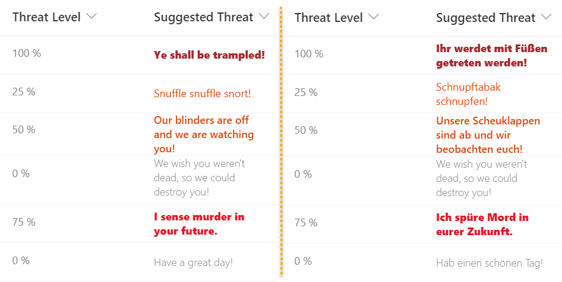

# Number Localization

## Summary
This sample demonstrates changing text output based on the `@lcid` token. This allows you to provide localized text within your format ensuring that users in various regions can use your formats without issue.

## View requirements

This format can be applied to any column. It expects a number column called `ThreatLevel` to be part of the view.

## Sample

Solution|Author(s)
--------|---------
number-localization.json | [Chris Kent](https://github.com/thechriskent) ([@thechriskent](https://twitter.com/thechriskent))

## Version history

Version|Date|Comments
-------|----|--------
1.0|May 12, 2022|Initial release

## Disclaimer
**THIS CODE IS PROVIDED *AS IS* WITHOUT WARRANTY OF ANY KIND, EITHER EXPRESS OR IMPLIED, INCLUDING ANY IMPLIED WARRANTIES OF FITNESS FOR A PARTICULAR PURPOSE, MERCHANTABILITY, OR NON-INFRINGEMENT.**

---

## Additional notes

- [Use column formatting to customize SharePoint](https://docs.microsoft.com/en-us/sharepoint/dev/declarative-customization/column-formatting)

