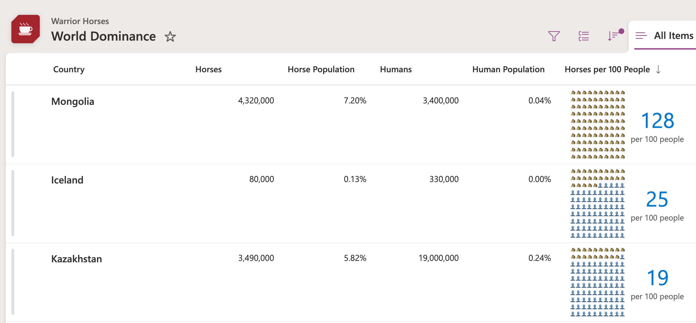

# Per 100 People Grid

## Summary
This sample demonstrates displaying a grid of 100 dots where dots are colored based on how many of something per 100 people. The format shows of nested `forEach` elements using `loopIndex` to reference position and `em` size units to show relative scaling based on the root `font-size`. Wowee!

### number-per-100-people-grid.json
This is the primary sample. It uses the `@currentField` value, but you could switch this out to reference a different column if you'd like. You can also adjust the sizing by adjusting the `fontSize` of the root element.

### number-per-100-people-gallery.json
This is a gallery view format that utilizes `columnFormatterReference` to pull in the `number-per-100-people-grid.json` format. It assumes the column name is `HorsesPerPeople` so just swap that out for your column where the format is applied. You can have the scaling be inherited from the gallery settings by removing the `font-size` from the root element (the column will inherit from the list and the gallery will inherit from it's root element).

### number-per-100-people-grid-emoji.json
This is an example of taking the same technique but using emojis instead.

## View requirements

This format can be applied to any number column. It expects the value to be a value from 0 to 100 (values above or below this number won't be accurately reflected). This could be a percent value if you'd like, you'll just need to update the formula to multiply it by 100.

## Sample

Solution|Author(s)
--------|---------
number-per-100-people-grid.json | [Chris Kent](https://github.com/thechriskent)
number-per-100-people-gallery.json | [Chris Kent](https://github.com/thechriskent)
number-per-100-people-grid-emoji.json | [Chris Kent](https://github.com/thechriskent)

## Version history

Version|Date|Comments
-------|----|--------
1.0|September 25, 2025|Initial release

## Disclaimer
**THIS CODE IS PROVIDED *AS IS* WITHOUT WARRANTY OF ANY KIND, EITHER EXPRESS OR IMPLIED, INCLUDING ANY IMPLIED WARRANTIES OF FITNESS FOR A PARTICULAR PURPOSE, MERCHANTABILITY, OR NON-INFRINGEMENT.**

---

## Additional notes

- [Use column formatting to customize SharePoint](https://docs.microsoft.com/en-us/sharepoint/dev/declarative-customization/column-formatting)

