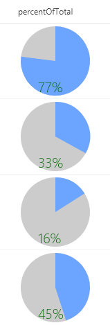

# Formatting percentage number (%) to pie chart.

## Summary
This example renders whole pie in gray with radius 50 and the number% (column value) as a slice of the pie in blue using `<svg>` with `<path>` tags. The number% displayed at the bottom of the pie in green.

## Sample

Solution|Author(s)
--------|---------
number-pct-piechart.json | Aaron Miao

## Version history

Version|Date|Comments
-------|----|--------
1.0|Dec 13, 2017|Initial release
1.1|March 20, 2018|Added min & max values and fixed skewed drawing issue

## Disclaimer
**THIS CODE IS PROVIDED *AS IS* WITHOUT WARRANTY OF ANY KIND, EITHER EXPRESS OR IMPLIED, INCLUDING ANY IMPLIED WARRANTIES OF FITNESS FOR A PARTICULAR PURPOSE, MERCHANTABILITY, OR NON-INFRINGEMENT.**

---

## Additional notes

A similar wizard is also included in the [Column Formatter](https://github.com/SharePoint/sp-dev-solutions/blob/master/solutions/ColumnFormatter/README.md) webpart that allows full customization.

