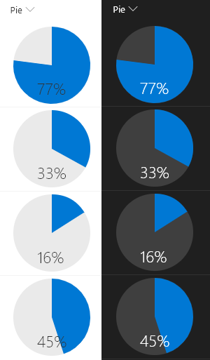

# Pie Chart

## Summary
This example renders whole pie in neutralLight with radius 50 and the number% (column value) as a slice of the pie in blue using `<svg>` with `<path>` tags. The number% displayed at the bottom of the pie in neutralPrimary.

The background and text colors are set using theme values by applying classes from the [Office UI Fabric](https://developer.microsoft.com/en-us/fabric#/styles/colors). Unfortunately, there is not a theme class for `fill` and so the pie is set to a specific value that will not update through theme switches and so should be chosen carefully. Both a light and dark theme are shown in the screenshot below.

## View requirements
- This format can be applied to a Number column

## Sample

Solution|Author(s)
--------|---------
number-piechart.json | [Aaron Miao](https://github.com/aaronmi), [Chris Kent](https://github.com/thechriskent) ([@thechriskent](https://twitter.com/thechriskent))

## Version history

Version|Date|Comments
-------|----|--------
1.0|Dec 13, 2017|Initial release
1.1|March 20, 2018|Added min & max values and fixed skewed drawing issue
1.2|August 20, 2018|Switched to Excel-style expressions and use of theme classes

## Disclaimer
**THIS CODE IS PROVIDED *AS IS* WITHOUT WARRANTY OF ANY KIND, EITHER EXPRESS OR IMPLIED, INCLUDING ANY IMPLIED WARRANTIES OF FITNESS FOR A PARTICULAR PURPOSE, MERCHANTABILITY, OR NON-INFRINGEMENT.**

---

## Additional notes

A similar wizard is also included in the [Column Formatter](https://github.com/SharePoint/sp-dev-solutions/blob/master/solutions/ColumnFormatter/README.md) webpart that allows full customization.

> An additional version using Abstract Tree Syntax (AST) is also provided for environments where the Excel-style expressions are not supported.

