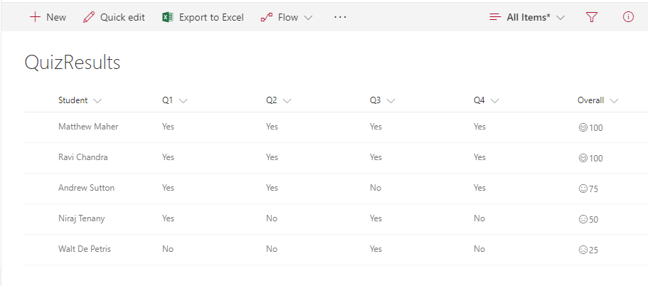

# Smiley faces for good quiz results

## Summary
This allows teachers to show smiley faces next to quiz results similar to how they do it on paper. The number (based on a 0-100 score) will indicate if its a smiley or frown, which come from the Offie UI Fabric Icon set. If the number is above 90 the student gets a super smiley (`Emoji`), above 75 regular smile (`Emoji2`), above 60 neutral smiley (`EmojiNeutral`), below 60 a frown (`EmojiDisappointed`), and anything else gets an `Unknown`.

## View requirements
- This format can be applied to a Number column

## Sample

Solution|Author(s)
--------|---------
number-quiz-smiley-face.json | Matt Maher

## Version history

Version|Date|Comments
-------|----|--------
1.0|December 1, 2017|Initial release
1.1|August 18, 2018|Switched to Excel-style expression

## Disclaimer
**THIS CODE IS PROVIDED *AS IS* WITHOUT WARRANTY OF ANY KIND, EITHER EXPRESS OR IMPLIED, INCLUDING ANY IMPLIED WARRANTIES OF FITNESS FOR A PARTICULAR PURPOSE, MERCHANTABILITY, OR NON-INFRINGEMENT.**

---

## Additional notes
This sample uses icons from the Office UI Fabric

- [Office UI Fabric](https://developer.microsoft.com/en-us/fabric)

> An additional version using Abstract Tree Syntax (AST) is also provided for environments where the Excel-style expressions are not supported.

