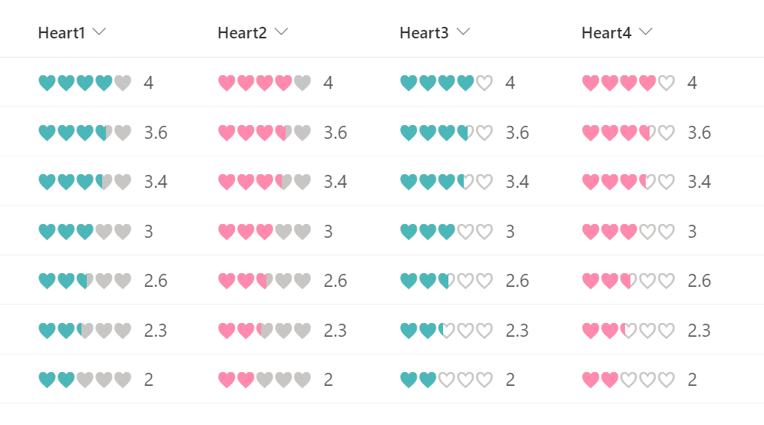

# Star Rating

## Summary
This sample demonstrates changing the value of a number column to a star rating.

- `number-star-rating.json` uses the theme color of the site as the color of the star.
- `number-star-rating-custom-color.json` uses the HTML color code as the the color of the star, and in the sample, `#FFB951` is set.

You can also change the `★` set in `txtContent` to `♥` or `♡` to make it a heart rating.

## View requirements
This format can be applied to a Number column (the format expects values from 0-5)

## Sample

Solution|Author(s)
--------|---------
number-star-rating.json | [Tetsuya Kawahara](https://github.com/tecchan1107)
number-star-rating-custom-color.json | [Tetsuya Kawahara](https://github.com/tecchan1107)

## Version history

Version |Date          |Comments
--------|--------------|--------
1.0     |June 11, 2022 |Initial release

## Disclaimer
**THIS CODE IS PROVIDED *AS IS* WITHOUT WARRANTY OF ANY KIND, EITHER EXPRESS OR IMPLIED, INCLUDING ANY IMPLIED WARRANTIES OF FITNESS FOR A PARTICULAR PURPOSE, MERCHANTABILITY, OR NON-INFRINGEMENT.**

