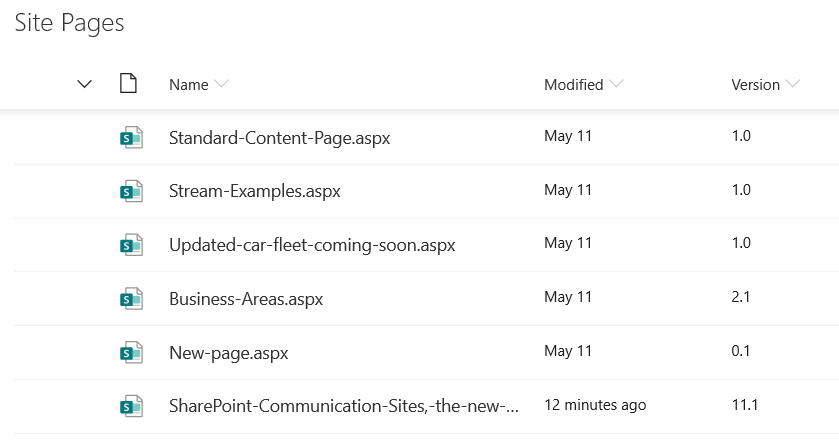
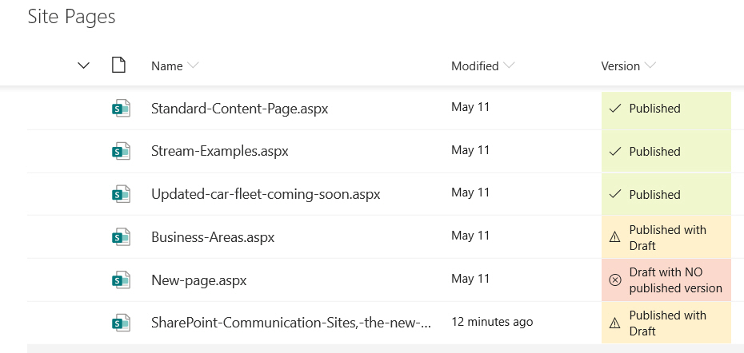

# Publishing Status

## Summary
Sample contains an example of using the modulo math expression for highlighting 'published', 'published with draft' and 'draft with no published versions' of pages

**Before**

**After**

## View requirements

- Add the version column to the view, this must be done via the "Edit current view" or classic view editing page to see the version column option.

## Sample

Solution|Author(s)
--------|---------
number-version-publish-status.json | [Paul Bullock](https://github.com/pkbullock)

## Version history

Version|Date|Comments
-------|----|--------
1.0| May 20, 2019|Initial release
1.1| June 15, 2022|Version number added

## Disclaimer
**THIS CODE IS PROVIDED *AS IS* WITHOUT WARRANTY OF ANY KIND, EITHER EXPRESS OR IMPLIED, INCLUDING ANY IMPLIED WARRANTIES OF FITNESS FOR A PARTICULAR PURPOSE, MERCHANTABILITY, OR NON-INFRINGEMENT.**

---

## Additional notes

