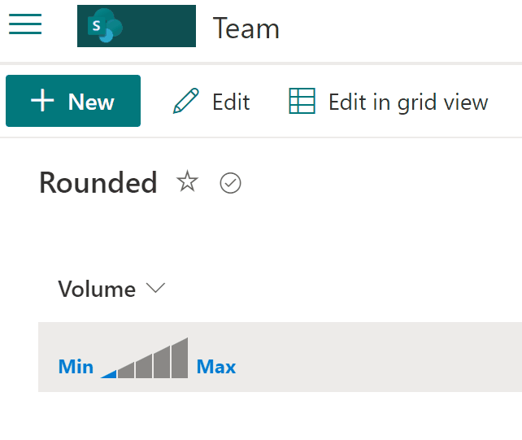

# Volume Option

## Summary
This sample includes visual selection of volume from 0 to 5.

## View requirements
- The format expect the following fields:

Field |Type
--------|---------
Volume | Number - Volume options from 0 to 5 

## Sample

Solution|Author(s)
--------|---------
number-volume.json | [André Lage](https://github.com/aaclage) ([@aaclage](https://twitter.com/aaclage))

## Version history

Version|Date|Comments
-------|----|--------
1.0|April 01, 2022|Initial release

## Disclaimer
**THIS CODE IS PROVIDED *AS IS* WITHOUT WARRANTY OF ANY KIND, EITHER EXPRESS OR IMPLIED, INCLUDING ANY IMPLIED WARRANTIES OF FITNESS FOR A PARTICULAR PURPOSE, MERCHANTABILITY, OR NON-INFRINGEMENT.**

