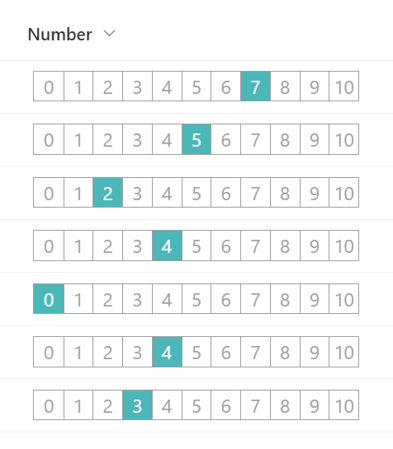

# 0 to 10 Rating Scale

## Summary

This sample demonstrates the use of the `split` operator to change the value of a number column to the appearance of a 0 to 10 rating scale.

## View requirements
This format can be applied to a Number column (the format expects values from 0-10)

## Sample

Solution|Author(s)
--------|---------
number-zero-to-ten-rating.json | [Tetsuya Kawahara](https://github.com/tecchan1107)

## Version history

Version |Date               |Comments
--------|-------------------|--------
1.0     |September 18, 2022 |Initial release

## Disclaimer
**THIS CODE IS PROVIDED *AS IS* WITHOUT WARRANTY OF ANY KIND, EITHER EXPRESS OR IMPLIED, INCLUDING ANY IMPLIED WARRANTIES OF FITNESS FOR A PARTICULAR PURPOSE, MERCHANTABILITY, OR NON-INFRINGEMENT.**

