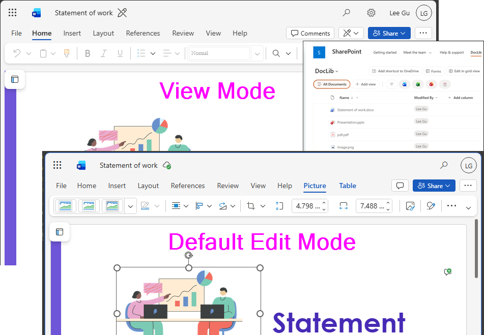

# Open Office Documents in View Mode

## Summary
By default, office documents in a SharePoint document library open in Edit mode. That behaviour is convenient for authors, but not always ideal for readers.
Why defaulting documents to Read-Only in SharePoint Online makes sense:
-Prevent accidental changes
-Better data integrity and cleaner version history
-Improved reader experience
You can achieve this by using column formatting on the Name column.

## View requirements
This format can be applied to the Name column (file name) within a SharePoint document library.

> [!NOTE]

Type        |Action    |Extensions
------------|----------|-
Word        |View      |docx, docm, doc
Excel       |View      |xlsx, xlsm, xls
PowerPoint  |embedview |pptx, pptm, ppt
Other types |FileRef   |all other file types

## Sample

Solution|Author(s)
--------|-
open-document-in-view-mode.json | [Watana](https://github.com/watana2)

## Version history

Version |Date            |Comments
--------|----------------|-
1.0     |April 12, 2026  |Initial release

## Disclaimer
**THIS CODE IS PROVIDED *AS IS* WITHOUT WARRANTY OF ANY KIND, EITHER EXPRESS OR IMPLIED, INCLUDING ANY IMPLIED WARRANTIES OF FITNESS FOR A PARTICULAR PURPOSE, MERCHANTABILITY, OR NON-INFRINGEMENT.**

