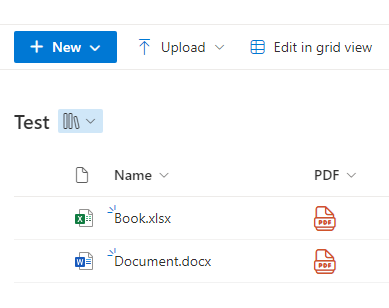

# OOB PDF Conversion

## Summary
Converting office documents to PDF using SharePoint REST API v2 and outputting to a public URL for viewing.


```
https://learn.microsoft.com/en-us/graph/api/driveitem-get-content-format?view=graph-rest-1.0
GET /drive/root:/{path and filename}:/content?format={format}
E.g.  : https://CONTOSO.sharepoint.com/sites/SITENAME1/_api/v2.0/drives/DOC_LIB_DRIVE_ID/root:/FOLDER1/SUB2/FILENAME.TYPE:/content?format=pdf
"href": "=@currentWeb + '/_api/v2.0/drives/b!s4---/root:/' + substring([$FileRef],indexOf(replace(replace(replace(replace([$FileRef],'/','x'),'/','x'),'/','x'),'/','|'),'|') + 1,indexOf([$FileRef]+'|','|')) + ':/content?format=pdf'"
"href": "=@currentWeb + '/_api/v2.0/drives/b!s4---/root:/' + substring([$FileRef],indexOf(replace(replace(replace(replace([$FileRef],'/','x'),'/','x'),'/','x'),'/','|'),'|') + 1,400) + ':/content?format=pdf'"

@currentWeb    => https://contoso.sharepoint.com/sites/site1
[$FileRef]     =>                               /sites/site1/Lib/F/file1.docx ✔
[$FileLeafRef] =>                                                  file1.docx

OPTION 1
replace([$FileRef],'/sites/site1/Lib/','') => F/file1.docx

OPTION 2
        replace('https://contoso.sharepoint.com'+[$FileRef],@currentWeb,'')             => /Lib/F/file1.docx
replace(replace('https://contoso.sharepoint.com'+[$FileRef],@currentWeb,''),'/Lib/','') =>      F/file1.docx

OPTION 3
  indexOf([$FileRef]+'|','|') => 29 (number of chars)
substring([$FileRef],0,99)                                                                                       => /sites/site1/Lib/F/file1.docx
substring([$FileRef],0,indexOf([$FileRef]+'|','|'))                                                              => /sites/site1/Lib/F/file1.docx
                             replace(replace(replace(replace([$FileRef],'/','-'),'/','-'),'/','-'),'/','|')      => -sites-site1-Lib|F/file1.docx
                     indexOf(replace(replace(replace(replace([$FileRef],'/','-'),'/','-'),'/','-'),'/','|'),'|') => 16
substring([$FileRef],indexOf(replace(replace(replace(replace([$FileRef],'/','-'),'/','-'),'/','-'),'/','|'),'|')+1,indexOf([$FileRef]+'|','|')) => F/file1.docx

OPTION 4
  indexOf([$FileRef]+'|','|') => 29 (number of chars)
substring([$FileRef],0,400)                                                                                             => /sites/site1/Lib/F/file1.docx
substring([$FileRef],0,indexOf([$FileRef]+'|','|'))                                                                     => /sites/site1/Lib/F/file1.docx
                             replace(replace(replace(replace([$FileRef],'/','-'),'/','-'),'/','-'),'/','|')             => -sites-site1-Lib|F/file1.docx
                     indexOf(replace(replace(replace(replace([$FileRef],'/','-'),'/','-'),'/','-'),'/','|'),'|')        => 16
substring([$FileRef],indexOf(replace(replace(replace(replace([$FileRef],'/','-'),'/','-'),'/','-'),'/','|'),'|')+1,400) => F/file1.docx

```

## View requirements
- Office docs

## Sample

Solution|Author(s)
--------|---------
pdf-conversion.json | [Watana](https://github.com/Watana2)


## Version history

Version|Date|Comments
-------|----|--------
1.0|March 24, 2024|Initial release

## Disclaimer

**THIS CODE IS PROVIDED *AS IS* WITHOUT WARRANTY OF ANY KIND, EITHER EXPRESS OR IMPLIED, INCLUDING ANY IMPLIED WARRANTIES OF FITNESS FOR A PARTICULAR PURPOSE, MERCHANTABILITY, OR NON-INFRINGEMENT.**

---
