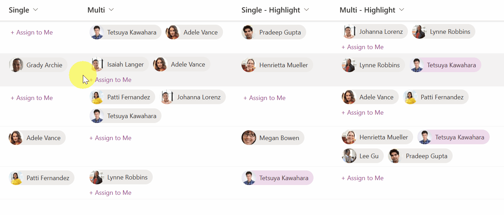

# Assign to Me

## Summary

This sample demonstrates the use of the `setValue` action of `customRowAction` to set the current logged-in user in the Person column.

> [!NOTE]
> If you use this sample, you need to set the `actionInput` to the internal name of the Person column to be updated.

## View requirements
- This format can be applied to a Person column.

## Sample

Solution|Author(s)
--------|---------
person-assign-to-me.json | [Tetsuya Kawahara](https://github.com/tecchan1107) ([@techan_k](https://twitter.com/techan_k))
person-assign-to-me-multi.json | [Tetsuya Kawahara](https://github.com/tecchan1107) ([@techan_k](https://twitter.com/techan_k))

## Version history

Version |Date         |Comments
--------|-------------|--------
1.0     |May 11, 2023 |Initial release

## Disclaimer
**THIS CODE IS PROVIDED *AS IS* WITHOUT WARRANTY OF ANY KIND, EITHER EXPRESS OR IMPLIED, INCLUDING ANY IMPLIED WARRANTIES OF FITNESS FOR A PARTICULAR PURPOSE, MERCHANTABILITY, OR NON-INFRINGEMENT.**

