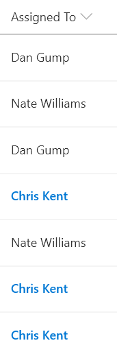

# Highlight the current user

## Summary
This sample uses the `@me` keyword to check if the person field is the current user and shows that person using a different color. This is a dynamic check that will always highlight the user using the list (not the creater of the format). This template could easily be extended to apply different/additional styles or icons as desired by simply copying the same operator/operand logic for other fields.

## Sample

Solution|Author(s)
--------|---------
person-currentuser-format.json | [Chris Kent](https://twitter.com/thechriskent)

## Version history

Version|Date|Comments
-------|----|--------
1.0|March 20, 2018|Initial release

## Disclaimer
**THIS CODE IS PROVIDED *AS IS* WITHOUT WARRANTY OF ANY KIND, EITHER EXPRESS OR IMPLIED, INCLUDING ANY IMPLIED WARRANTIES OF FITNESS FOR A PARTICULAR PURPOSE, MERCHANTABILITY, OR NON-INFRINGEMENT.**

---

## Additional notes
This sample is also covered in the main documentation around Column Formatting.

This template is also included in the [Column Formatter](https://github.com/SharePoint/sp-dev-solutions/blob/master/solutions/ColumnFormatter/README.md) webpart.

- [Use column formatting to customize SharePoint](https://docs.microsoft.com/en-us/sharepoint/dev/declarative-customization/column-formatting#me)

