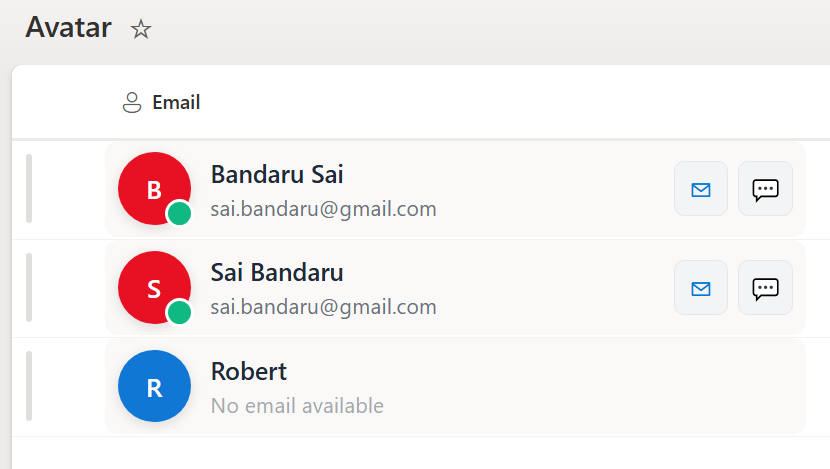

# SharePoint Column Formatting – People Card with Custom Avatar

## Summary

This SharePoint column formatting sample provides a modern, interactive **People card** for list items using JSON formatting. It enhances the display of user information and enables **quick actions** directly from the list. The column supports **Person or Group type fields for Email**, making it fully compatible with SharePoint user data.

## View Requirements

- This format expects to be applied to a Person column

## Key Features

### Custom Avatar
- Displays the **first letter of the user’s name** inside a circular avatar.
- **Dynamic background color**:
  - **Red (`#e81123`)** if the user has an email.
  - **Blue (`#1078D4`)** if no email is provided.
- Rounded circle with shadow and uppercase initials for visibility.
- **Hover effects** enhance user experience.

### Person/Email Integration
- Works with **Person or Group column type** to extract the user's email and display name.
- Automatically shows `"No email available"` if the person field is empty.

### Quick Actions
- **Email button** opens the default mail client with the user's email.
- **Teams chat button** opens Microsoft Teams for direct conversation.

### Hover Card
- Displays detailed user information when hovering over the avatar.
- Includes secondary actions like sending email or starting Teams chat.

### Responsive Layout
- Adapts to column widths and is mobile-friendly.
- Flexible spacing ensures clean alignment of avatar, name, and actions.

## Usage Instructions
1. Navigate to your **SharePoint list**.
2. Click the column header → **Column settings** → **Format this column**.
3. Paste the JSON sample into the formatting editor.
4. Save the column formatting.

The column will now display **custom avatars** with **hover cards** and **action buttons**.

## Requirements
- **SharePoint Online (Modern Experience)**
- **Person or Group column type** for Email
- Modern browser for full functionality

## Sample

Solution|Author(s)
--------|---------
person-name-avatar.json | [Sai Bandaru](https://github.com/saiiiiiii)

## Version history

| Version | Date | Comments |
|---------|------|---------|
| 1.0 | August 25, 2025 | Initial release |

## Disclaimer
**THIS CODE IS PROVIDED *AS IS* WITHOUT WARRANTY OF ANY KIND, EITHER EXPRESS OR IMPLIED, INCLUDING ANY IMPLIED WARRANTIES OF FITNESS FOR A PARTICULAR PURPOSE, MERCHANTABILITY, OR NON-INFRINGEMENT.**

