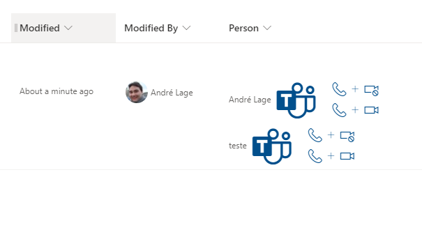

# teams call format

## Summary
This sample uses [Microsoft Teams deep links](https://docs.microsoft.com/en-us/microsoftteams/platform/concepts/build-and-test/deep-links#deep-linking-to-an-audio-or-audio-video-call)  to create links from selected user that allow to make Microsoft Teams calls to user.

## View requirements
- The format expect the following fields:

Field |Type
--------|---------
Person | Person - Person field with multiple selections

## Sample

Solution|Author(s)
--------|---------
[teams-call-format.json](./teams-call-format.json) | [André Lage](https://twitter.com/aaclage)

## Version history

Version|Date|Comments
-------|----|--------
1.0|December 16, 2021|Initial release

## Disclaimer
**THIS CODE IS PROVIDED *AS IS* WITHOUT WARRANTY OF ANY KIND, EITHER EXPRESS OR IMPLIED, INCLUDING ANY IMPLIED WARRANTIES OF FITNESS FOR A PARTICULAR PURPOSE, MERCHANTABILITY, OR NON-INFRINGEMENT.**

