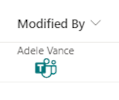
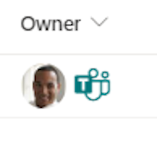

# Teams Message Format

## Summary
This sample is using [Microsoft Teams deep links](https://learn.microsoft.com/microsoftteams/platform/concepts/build-and-test/deep-link-teams#configure-deep-link-to-start-a-chat-manually) to create a link that allows a user to send Microsoft Teams messages to the user in the column.

- person-teams-message-format-name-picture.json

    

- person-teams-message-format-name.json

    

- person-teams-message-format-picture.json

    

## View requirements
- This format expects to be applied to a Person column

## Sample

Solution|Author(s)
--------|---------
person-teams-message-format.json | [Steve Corey](https://github.com/stevecorey365) ([@stevecorey365](https://twitter.com/stevecorey365))
person-teams-message-format-name.json | [Steve Corey](https://github.com/stevecorey365) ([@stevecorey365](https://twitter.com/stevecorey365))
person-teams-message-format-picture.json | [Steve Corey](https://github.com/stevecorey365) ([@stevecorey365](https://twitter.com/stevecorey365))

## Version history

Version|Date|Comments
-------|----|--------
1.0|September 20, 2023|Initial release

## Disclaimer
**THIS CODE IS PROVIDED *AS IS* WITHOUT WARRANTY OF ANY KIND, EITHER EXPRESS OR IMPLIED, INCLUDING ANY IMPLIED WARRANTIES OF FITNESS FOR A PARTICULAR PURPOSE, MERCHANTABILITY, OR NON-INFRINGEMENT.**

