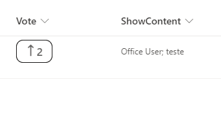

# Person vote format

## Summary
Custom Like/Vote field without using activate rating Settings. This field Add/remove users from Person (appendTo/removeFrom) from array and display amount of votes.

## View requirements
- This format expects a person column (allow multiple users) with an internal name of `Vote` to be part of the view 

## Sample

Solution|Author(s)
--------|---------
person-vote-format | [André Lage](https://twitter.com/aaclage)

## Version history

Version|Date|Comments
-------|----|--------
1.0|January 6, 2022|Initial release

## Disclaimer
**THIS CODE IS PROVIDED *AS IS* WITHOUT WARRANTY OF ANY KIND, EITHER EXPRESS OR IMPLIED, INCLUDING ANY IMPLIED WARRANTIES OF FITNESS FOR A PARTICULAR PURPOSE, MERCHANTABILITY, OR NON-INFRINGEMENT.**

---

## Additional notes

