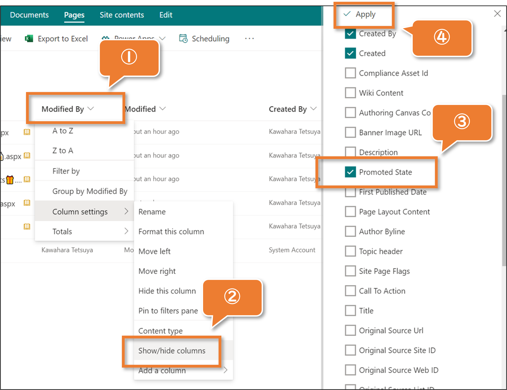

# Demoting the news

## Summary
In the Site Pages library, there is a Promoted State column. Depending on the value stored in this column, you can identify whether it is a page or a news. The correspondence between the value and page type is as follows.

Promoted State |Page Type
---------------|-----------------------
0              |Page
1              |News not yet published
2              |News

Once a page is created as news, it cannot be demoted to a page under normal circumstances.

This sample demonstrates how to use the setValue action to update the value of the Promoted State column to 0 and demote the news to a page.

## Prerequisites
The Promoted State column needs to be displayed in the view. The following is how to display it.

1. Click any column.
2. Click **Show/hide Columns**
3. Check **Promoted State**
4. Click **Apply**

## View requirements
This format can be applied to a Promoted State column.

## Sample

Solution                       |Author(s)
-------------------------------|---------------------------
promotedstate-demote-news.json |[Tetsuya Kawahara](https://twitter.com/techan_k)

## Version history

Version |Date              |Comments
--------|------------------|--------
1.0     |December 11, 2021 |Initial release

## Disclaimer
**THIS CODE IS PROVIDED *AS IS* WITHOUT WARRANTY OF ANY KIND, EITHER EXPRESS OR IMPLIED, INCLUDING ANY IMPLIED WARRANTIES OF FITNESS FOR A PARTICULAR PURPOSE, MERCHANTABILITY, OR NON-INFRINGEMENT.**

