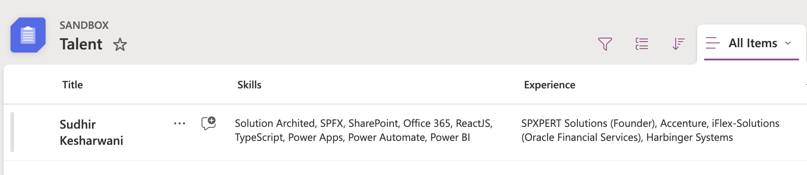
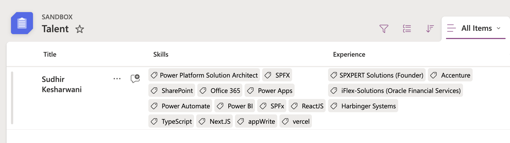

# Display Comma-Separated Text as Tags

## Summary

This sample demonstrates using the `split` function (O365 only) to display a comma separated text as tags. The sample also uses the `forEach` attribute to demostrate the forEach loop capability. In this sample, the comma separated text values are displayed as a tags for the record. JAZZ up your SharePoint list display with this awesome column formatting.

- Plain SharePoint list with comma separated text.
  

- Your new SharePoint list with values displayed as tags.
  

## View requirements

- This format can be applied to a Single Line of Text or Multiline of Text column
- This format uses operators only available in SharePoint Online and cannot be used in SharePoint 2019

## Sample

Solution|Author(s)
--------|---------
text-comma-separated-value-tags.json | [Sudhir Kesharwani](https://github.com/sudhirke)

## Version history

| Version | Date               | Comments        |
| ------- | ------------------ | --------------- |
| 1.0     | September 04, 2025 | Initial release |

## Disclaimer

**THIS CODE IS PROVIDED _AS IS_ WITHOUT WARRANTY OF ANY KIND, EITHER EXPRESS OR IMPLIED, INCLUDING ANY IMPLIED WARRANTIES OF FITNESS FOR A PARTICULAR PURPOSE, MERCHANTABILITY, OR NON-INFRINGEMENT.**

---

## Additional notes

- [Use column formatting to customize SharePoint](https://docs.microsoft.com/sharepoint/dev/declarative-customization/column-formatting)

- This sample was built and tested on SharePoint Online. This may not work on the ON-PREM SharePoint editions.

