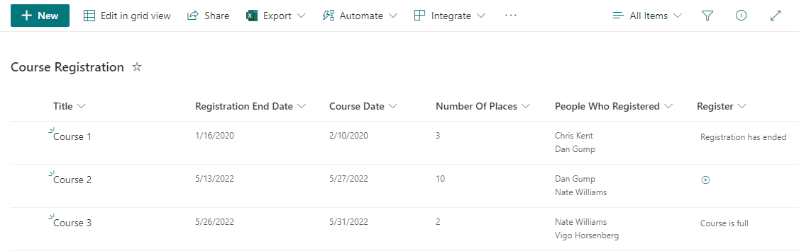

# Course Registration

## Summary
Demonstrates creating a button to register for a course. It checks if the course is already full or if the user has already registered for the course and prevents registration when either is true.

## View requirements

|Type|Internal Name|Additional Information
|---|:---:|---|
|DateTime|RegistrationEndDate| Column for when the registration period for the course ends
|DateTime|CourseDate|Column for when the Course is scheduled
|Text|Register|Column to show the registration button, apply the template to this column
|Number|NumberOfPlaces|Column for the number of available places in the course
|Multi-Person|PeopleWhoRegistered|Column to track the number of people who already registered

## Sample

Solution|Author(s)
--------|---------
text-course-registration.json | [Dennis](https://github.com/expiscornovus), [Chris Kent](https://github.com/thechriskent)

## Version history

Version |Date          |Comments
--------|--------------|--------------------------------
1.0     |November 25, 2021 |Initial release
2.0     |May 10, 2022 | Added unregister functionality

## Disclaimer
**THIS CODE IS PROVIDED *AS IS* WITHOUT WARRANTY OF ANY KIND, EITHER EXPRESS OR IMPLIED, INCLUDING ANY IMPLIED WARRANTIES OF FITNESS FOR A PARTICULAR PURPOSE, MERCHANTABILITY, OR NON-INFRINGEMENT.**
##

---

## Additional notes

