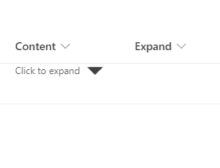

# Expand collapse format

## Summary
The following sample provide a format that display content based on expand/collapse effect using support column and option `setValue`.

> Note - This relies on updating the underlying list item meaning that the expanded/collapse state applies to ALL users viewing the item

## View requirements
- This format can be applied to any column type though the example is based on a single line of text field.

Column Name|Type
--------|---------
Content  | single line of text
Expand | Yes/No - default value **"No"**

## Sample

Solution|Author(s)
--------|---------
text-expand-collapse-format.json | [André Lage](https://github.com/aaclage) ([@aaclage](https://twitter.com/aaclage))

## Version history

Version|Date|Comments
-------|----|--------
1.0|January 10, 2022|Initial release

## Disclaimer
**THIS CODE IS PROVIDED *AS IS* WITHOUT WARRANTY OF ANY KIND, EITHER EXPRESS OR IMPLIED, INCLUDING ANY IMPLIED WARRANTIES OF FITNESS FOR A PARTICULAR PURPOSE, MERCHANTABILITY, OR NON-INFRINGEMENT.**

---

## Additional notes

