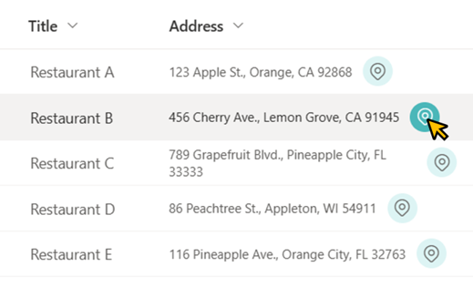

# Display Link to Google Maps

## Summary
This sample demonstrates displaying a link to Google Maps. The URL for that link is set to the value `https://maps.google.com/maps?q=[Field Value]` and when the link is opened, a map around the location of the field value is displayed.

## View requirements
- This format can be applied to any column type (but is intended for text fields)

## Sample

Solution|Author(s)
--------|---------
text-googlemaps-link.json | [Tetsuya Kawahara](https://github.com/tecchan1107) ([@techan_k](https://twitter.com/techan_k))

## Version history

Version |Date          |Comments
--------|--------------|--------
1.0     |April 6, 2023 |Initial release

## Disclaimer
**THIS CODE IS PROVIDED *AS IS* WITHOUT WARRANTY OF ANY KIND, EITHER EXPRESS OR IMPLIED, INCLUDING ANY IMPLIED WARRANTIES OF FITNESS FOR A PARTICULAR PURPOSE, MERCHANTABILITY, OR NON-INFRINGEMENT.**

