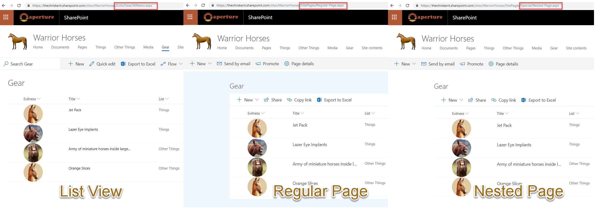

# Demonstrates how to reference a local image

## Summary
This sample provides multiple formats to illustrate the options available to reference local image files. The primary purpose is to demonstrate the usage of `@currentWeb` (O365 only) to prevent issues with reusable formats or formats rendered outside of the main list view.

## Formats

### text-local-image

This format is the one you should use if you are using Office 365. The image's `src` attribute is built using the `@currentWeb` token. This ensures that your format is reusable between sites and can be used within your site regardless of level (folder).

### text-hardcoded-image

This format illustrates providing a full URL (including the tenant and site). This is NOT recommended because while the image will always work regardless of level, the format will have to be manually updated to be reused. For example, to use this format in your own environment you will first have to update the tenant URL.

> An additional version using Abstract Tree Syntax (AST) is also provided for environments where the Excel-style expressions are not supported (SP2019).

### text-relative-image

This format illustrates providing a relative link that assumes the format knows the position of the resources relative to where the format is rendered. This is NOT recommended because while the format is reusable across sites without manual updates required, the format is very fragile because it can easily break across your site depending on the relative location the format is rendered. For instance, a page using a list web part will be at a different level (relative foldering) than the list view itself.

> An additional version using Abstract Tree Syntax (AST) is also provided for environments where the Excel-style expressions are not supported (SP2019).

## View requirements
- This format can be applied to a Text or Choice column

## Sample

Solution|Author(s)
--------|---------
text-hardcoded-image.json | [Chris Kent](https://twitter.com/thechriskent)
text-relative-image.json | [Chris Kent](https://twitter.com/thechriskent)
text-local-image.json | [Chris Kent](https://twitter.com/thechriskent)

## Version history

Version|Date|Comments
-------|----|--------
1.0|January 10, 2018|Initial release

## Disclaimer
**THIS CODE IS PROVIDED *AS IS* WITHOUT WARRANTY OF ANY KIND, EITHER EXPRESS OR IMPLIED, INCLUDING ANY IMPLIED WARRANTIES OF FITNESS FOR A PARTICULAR PURPOSE, MERCHANTABILITY, OR NON-INFRINGEMENT.**

---

## Additional notes
- [Use column formatting to customize SharePoint](https://docs.microsoft.com/en-us/sharepoint/dev/declarative-customization/column-formatting)

The image's `src` attribute uses the `@currentWeb` token to ensure that regardless of where the format is rendered, the images will be pulled from the correct folder in the Documents library for the site. However, `@currentWeb` is not available in SharePoint 2019, so alternative approaches are included.

